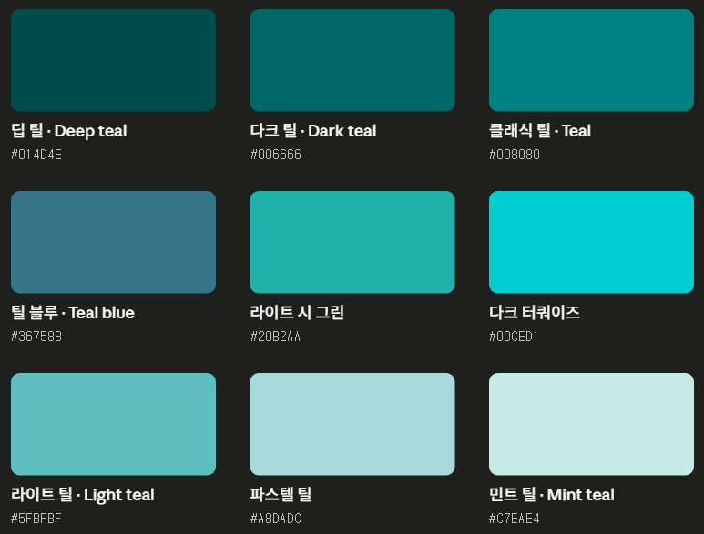
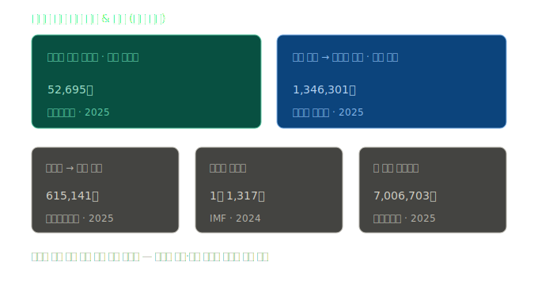
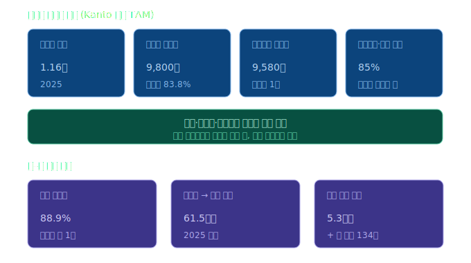

# Kanto

## 프로젝트 소개

프로젝트 Kanto는 필리핀에서 "우리 동네"라는 뜻을 가지고 있습니다.

필코(필리핀 & 코리아) 커뮤니티 "필고"와 "당근"에 영감을 받아 필리핀과 한국인을 이어주는 커뮤니티를 현대적인 UI를 겸비해 보다 신뢰도 있는 사이트를 제작하고자 하는 목표를 가지고 시작하게 되었습니다.

필리핀 한인들의 구인구직, 방렌트, 중고거래는 여전히 페이스북 그룹에 의존하고 있습니다. 체계적인 플랫폼 없이 게시글이 뒤섞여 있기 때문에 제대로 된 사이트를 만든다면 유저들이 매력을 느끼기에 충분하다고 생각합니다.

## 대표 색상



대표적인 색상은 **Teal 계열**을 선택했습니다.

Teal 색상은 한때 필리핀의 바다 색상을 본 뒤 힐링을 받았던 기억이 있어 필리핀의 바다와 열대 해양 환경에서 영감을 받았습니다.

또한 Teal 색상은 자연을 상징하면서도 사람에게 높은 **신뢰와 성장, 공동체**를 상징하는 색상이기도 합니다.

기존에 존재하던 필고 커뮤니티와는 다르게 필리핀의 생활 전반을 연결하는 라이프 플랫폼을 지향합니다.

## 구체적인 데이터



위 데이터 수치는 한인 시장의 규모입니다.



2025년 필리핀은 "세계 소셜 미디어 수도"로 꼽혔을 정도로 필리핀의 디지털 시장의 이용 시간은 매우 높지만 모두 페이스북 사용자로 흩어져 있고, 이러한 많은 수요를 감당할 전용 플랫폼이 없다는 점입니다.

## 팀원

| 이름   | 역할 | GitHub          |
| ------ | ---- | --------------- |
| 박소유 | 팀장 | [@soyupark1997](https://github.com/soyupark1997) |
| 김도혁 | 팀원 | [@DoHyuk-Centric](https://github.com/DoHyuk-Centric) |
| 이동근 | 팀원 | [@dongkeun99](https://github.com/dongkeun99) |
| 임태형 | 팀원 | [@THLIMM](https://github.com/THLIMM) |

## 기술 스택

### Frontend
| 분류 | 기술 |
| ---- | ---- |
| 프레임워크 | Next.js 16 (App Router), React 19 |
| 언어 | TypeScript |
| 스타일링 | Tailwind CSS 4, shadcn/ui, Radix UI |
| 아이콘 | Lucide React |
| 상태관리 | Zustand |
| 국제화 | next-intl (한국어 / 영어 / 필리핀어) |
| 마크다운 | react-markdown, remark-gfm |

### Backend & 인프라
| 분류 | 기술 |
| ---- | ---- |
| 데이터베이스 / 인증 | Supabase (PostgreSQL + Auth) |
| 결제 | Xendit (Philippines Peso) |
| 캐싱 / 레이트리밋 | Upstash Redis |
| 이메일 | Nodemailer (Gmail) |
| 문서 관리 | Notion API |

## 주요 기능

- **중고거래**: 상품 등록·검색·카테고리 필터, 이미지 업로드, 안전결제(에스크로)
- **구인구직**: 채용 공고 등록·검색, 직종·지역 필터, 지원자 연락처 제공
- **방렌트**: 숙소·방 등록, 방 타입·편의시설·위치 기반 검색
- **실시간 채팅**: 판매자-구매자 간 1:1 채팅, 채팅 내 결제 요청
- **안전결제**: Xendit 기반 인보이스 발행, 거래 상태 추적
- **리뷰 시스템**: 거래 완료 후 상대방 평가
- **알림**: 채팅·댓글·게시글 알림, 사용자별 알림 설정
- **신고 / 제재**: 부적절한 콘텐츠·사용자 신고, 관리자 제재 처리
- **다국어 지원**: 한국어·영어·필리핀어 전환 (쿠키 기반 유지)
- **관리자 대시보드**: 사용자·게시글·채팅·신고 관리, KPI 통계

## 주요 페이지

### 사용자

| 경로 | 설명 |
| ---- | ---- |
| `/main` | 메인 피드 (검색, 히어로 배너, 인기 상품) |
| `/login` | 이메일/패스워드 로그인 |
| `/signup` | 회원가입 |
| `/profile` | 프로필·알림 설정·인증 상태 |
| `/notifications` | 알림 목록 |
| `/favorites` | 찜 목록 (카테고리별 탭) |
| `/myposts` | 내 게시글 관리 |
| `/usedgoods` | 중고거래 목록 |
| `/usedgoods/[id]` | 중고상품 상세 |
| `/job` | 구인구직 목록 |
| `/job/[id]` | 구인공고 상세 |
| `/rental` | 방렌트 목록 |
| `/rental/[id]` | 방 상세 |
| `/payment/return` | 결제 완료/실패 |
| `/terms/[type]` | 이용약관·개인정보처리방침 |

### 관리자

| 경로 | 설명 |
| ---- | ---- |
| `/admin` | 대시보드 (통계, 신고 현황) |
| `/admin/users` | 사용자 관리 |
| `/admin/posts` | 게시글 관리 |
| `/admin/chats` | 채팅 모니터링 |
| `/admin/reports` | 신고 처리 |

## 프로젝트 구조

```
src/
├── app/
│   ├── (user)/          # 사용자 페이지 (main, login, signup, job, rental, usedgoods, ...)
│   ├── (admin)/         # 관리자 페이지 (admin/*)
│   └── api/             # API 라우트 (auth, chat, payment, terms, user, ...)
├── components/
│   ├── common/          # 공통 컴포넌트 (Header, Footer, Chat, Notification, ...)
│   └── ui/              # shadcn UI 기본 컴포넌트
├── hooks/               # Custom React Hooks
├── services/            # 비즈니스 로직 / Supabase 쿼리
├── store/               # Zustand 전역 상태 (authStore, chatStore)
├── lib/                 # 클라이언트 초기화 (supabase, xendit, ...)
├── utils/               # 유틸리티 함수
├── type/                # TypeScript 타입 정의
├── constants/           # 상수 (routes, report)
└── i18n/                # 국제화 설정

messages/
├── ko.json              # 한국어
├── en.json              # 영어
└── fil.json             # 필리핀어
```

## 시작하기

### 환경변수 설정

프로젝트 루트에 `.env.local` 파일을 생성하고 아래 항목을 채워주세요.

```env
# Supabase
NEXT_PUBLIC_SUPABASE_URL=
NEXT_PUBLIC_SUPABASE_PUBLISHABLE_KEY=
SUPABASE_SECRET_KEY=

# Xendit (결제)
XENDIT_SECRET_KEY=
XENDIT_CALLBACK_TOKEN=
NEXT_PUBLIC_BASE_URL=http://localhost:3000/

# Upstash Redis (레이트리밋)
UPSTASH_REDIS_REST_URL=
UPSTASH_REDIS_REST_TOKEN=

# Notion (약관 관리)
NOTION_API_KEY=
NOTION_TERMS_PAGE_ID=
NOTION_TERMS_SERVICE_PAGE_ID=
NOTION_TERMS_PRIVACY_PAGE_ID=
NOTION_TERMS_POLICY_PAGE_ID=
NOTION_TERMS_YOUTH_PAGE_ID=
NOTION_TERMS_PAYMENT_PAGE_ID=
NOTION_TERMS_AGE_PAGE_ID=

# 이메일 (Gmail)
GMAIL_USER=
GMAIL_APP_PASSWORD=
```

### 실행

```bash
# 의존성 설치
npm install

# 개발 서버 실행
npm run dev

# 빌드
npm run build

# Supabase 타입 자동 생성
npm run gen:types
```

## 커밋 컨벤션

커밋 메시지는 `<type>: <설명>` 형식으로 작성합니다.

예시: `feat: 로그인 기능 추가`

### 커밋 타입

| 타입     | 설명                                      | 예시                                 |
| -------- | ----------------------------------------- | ------------------------------------ |
| feat     | 새로운 기능 추가                          | `feat: 회원가입 화면 구현`           |
| fix      | 버그 수정                                 | `fix: 로그인 시 토큰 만료 오류 수정` |
| refactor | 기능 변화 없는 코드 구조 개선             | `refactor: API 호출 로직 분리`       |
| chore    | 빌드/설정/패키지 등 잡무, 코드 외 작업    | `chore: eslint 설정 추가`            |
| bug      | 버그 제보/추적용 (fix와 구분해서 쓸 경우) | `bug: 결제 중복 발생 확인`           |
| hotfix   | 배포 중 긴급 버그 수정                    | `hotfix: 결제 웹훅 누락 수정`        |
| docs     | 문서 작성/수정                            | `docs: README 업데이트`              |

### 작성 규칙

- 제목은 50자 이내로 간결하게
- 명령형으로 작성 ("추가함" 보다 "추가")
- 무엇을, 왜 바꿨는지가 드러나게

## 브랜치 전략

브랜치는 `<타입>/<작업내용>` 형식으로 만듭니다.

예시: `feature/login`, `fix/payment-error`, `hotfix/v1.0.1`

| 브랜치 | 역할 |
| ------ | ---- |
| `main` | 프로덕션 배포 |
| `develop` | 통합 개발 브랜치 |
| `feature/*` | 기능 개발 |
| `fix/*` | 버그 수정 |
| `hotfix/*` | 긴급 패치 |
