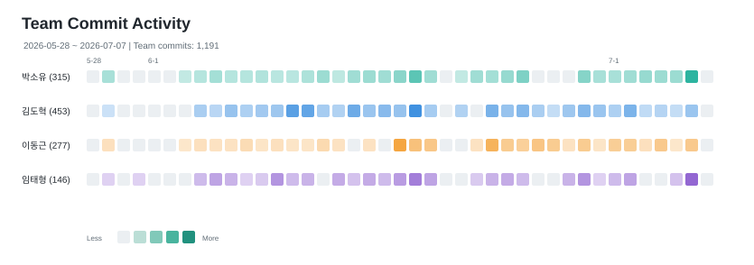

# Kanto

> 필리핀 생활 필수 플랫폼 — 중고거래·구인구직·부동산을 한 곳에서

## 🔗 링크

| 항목          | URL                                                                                       |
| ------------- | ----------------------------------------------------------------------------------------- |
| 라이브 데모   | [https://kanto-iota.vercel.app](https://kanto-iota.vercel.app)                            |
| 프로젝트 노션 | [Notion 기획 문서](https://app.notion.com/p/1-it-s-real-36e73873401a8099b037f045e2d2c9eb) |

> 테스트 계정 — ID: `asdf1234@naver.com` / PW: `asdf1234`

---

## 구체적인 데이터


2025년 필리핀은 "세계 소셜 미디어 수도"로 꼽혔을 정도로 필리핀의 디지털 시장의 이용 시간은 매우 높지만 모두 페이스북 사용자로 흩어져 있고, 이러한 많은 수요를 감당할 전용 플랫폼이 없다는 점입니다.

---

## 대표 색상


대표적인 색상은 **Teal 계열**을 선택했습니다.

Teal 색상은 한때 필리핀의 바다 색상을 본 뒤 힐링을 받았던 기억이 있어 필리핀의 바다와 열대 해양 환경에서 영감을 받았습니다.

또한 Teal 색상은 자연을 상징하면서도 사람에게 높은 **신뢰와 성장, 공동체**를 상징하는 색상이기도 합니다.

필리핀의 생활 전반을 연결하는 라이프 플랫폼을 지향합니다.

## 프로젝트 소개

프로젝트 Kanto는 필리핀에서 "우리 동네"라는 뜻을 가지고 있습니다.

필리핀 생활에 필요한 거래, 일자리, 주거 정보를 한곳에서 찾고 관리할 수 있는 신뢰도 높은 플랫폼을 목표로 시작했습니다.

구인구직, 부동산, 중고거래 정보는 여러 채널에 흩어져 있어 탐색과 비교가 어렵습니다. Kanto는 이 흐름을 체계적인 서비스로 묶어 사용자가 더 빠르고 안전하게 생활 정보를 찾도록 돕습니다.

## 개발 기간 및 팀원

| 항목      | 내용                             |
| --------- | -------------------------------- |
| 개발 기간 | 2026.05.28 ~ 2026.07.07 (약 6주) |
| 팀 구성   | 박소유, 김도혁, 이동근, 임태형   |
| 배포 환경 | Vercel (main 브랜치 자동 배포)   |

---

## 협업 방식

> 이 팀의 가장 큰 강점은 **협업**입니다. 6주라는 짧은 기간에 완성도 높은 서비스를 만들 수 있었던 핵심은 기술력만큼이나 팀 전체가 같은 맥락을 공유하며 빠르게 움직인 협업 문화였습니다.

### 소통 도구

| 도구    | 용도                                                    |
| ------- | ------------------------------------------------------- |
| Discord | 실시간 소통, 화면 공유 기반 페어 디버깅, 긴급 이슈 공유 |
| Notion  | WBS 일정 관리, 기획 문서, 회의록, 트러블슈팅 기록       |
| Figma   | UI 디자인 시안 공유 및 컴포넌트 레이아웃 협의           |

### 회의

하루에 한 번 꼴로 정기 회의를 진행했습니다. 각자 진행 상황을 공유하고 다음 사이클 작업을 조율했습니다. 회의에 참여하지 못한 팀원을 위해 회의록을 Notion에 남겨 언제든 내용을 따라잡을 수 있도록 했습니다.

### 역할 분담

기능 단위로 담당자를 지정했습니다. 한 기능을 혼자 처음부터 끝까지 책임지되, 다른 팀원이 이어받을 때를 대비해 코드와 설계 의도를 Notion에 문서화했습니다. 개발 기간 동안 팀원 기준 전체 **1,191개**의 커밋이 쌓였으며, 각 담당 영역과 기여 비중은 [조원별 기여](#조원별-기여) 섹션에서 확인할 수 있습니다.

### 커밋 전략

커밋을 기능과 변경 단위별로 최대한 잘게 유지했습니다. 덕분에 충돌이나 버그가 발생했을 때 특정 시점으로 되돌리거나 원인 커밋을 빠르게 찾아낼 수 있었습니다. 별도의 코드 백업 없이도 Git 이력 자체가 안전망이 되어 개발 속도를 높이는 데 기여했습니다.

### PR 정책

- 본인 외 팀원 1명 이상의 **Approve 필수** — 리뷰 없이 머지 불가
- PR 단위는 기능 단위로 유지해 리뷰 범위를 명확히 했습니다
- 리뷰어는 코드 동작 여부뿐 아니라 컨벤션·가독성·사이드 이펙트를 함께 검토했습니다

### 배포 및 핫픽스

`develop → main` 머지를 기준으로 총 3차에 걸쳐 단계적으로 배포했습니다.

| 차수 | 날짜       | 내용                                |
| :--: | ---------- | ----------------------------------- |
| 1차  | 2026-06-22 | 핵심 기능(거래·채팅·인증) 초기 배포 |
| 2차  | 2026-07-01 | 칸토고·결제·관리자 기능 추가 배포   |
| 3차  | 2026-07-06 | 디자인 개선·버그 수정·최종 마무리   |

배포 직후 실서비스 환경에서 발견된 이슈는 `hotfix/*` 브랜치를 즉시 분기해 긴급 수정 후 `main`과 `develop` 양쪽에 머지했습니다. 결제 웹훅 누락(`hotfix/v1.0.1`, 2026-06-22), Supabase Storage 트래픽 급증(`hotfix/524-resize`, 2026-07-03) 등 실제 운영 이슈를 직접 대응한 경험이 [트러블슈팅](#트러블슈팅) 섹션에 담겨 있습니다.

### 문서화 원칙

온·오프라인 참여가 어려운 상황에서도 팀 전체가 같은 맥락을 공유할 수 있도록 문서화를 중요하게 여겼습니다. 트러블슈팅 내용, 설계 결정 이유, 외부 서비스 연동 방법을 Notion에 기록했으며, 이 README의 [트러블슈팅](#트러블슈팅) 섹션도 그 연장선입니다.

---

## 브랜치 전략

브랜치는 `<타입>/<작업내용>` 형식으로 만듭니다.

예시: `feature/login`, `fix/payment-error`, `hotfix/v1.0.1`

| 브랜치      | 역할                             |
| ----------- | -------------------------------- |
| `main`      | 프로덕션 배포                    |
| `release`   | 배포 전 최종 검증 (QA·버그 수정) |
| `develop`   | 통합 개발 브랜치                 |
| `feature/*` | 기능 개발                        |
| `fix/*`     | 버그 수정                        |
| `hotfix/*`  | 긴급 패치                        |

## 커밋 컨벤션

커밋 메시지는 `<type>: <설명>` 형식으로 작성합니다.

예시: `feat: 로그인 기능 추가`

### 커밋 타입

| 타입     | 설명                                      | 예시                                 |
| -------- | ----------------------------------------- | ------------------------------------ |
| feat     | 새로운 기능 추가                          | `feat: 회원가입 화면 구현`           |
| fix      | 버그 수정                                 | `fix: 로그인 시 토큰 만료 오류 수정` |
| refactor | 기능 변화 없는 코드 구조 개선             | `refactor: API 호출 로직 분리`       |
| chore    | 빌드/설정/패키지 등 잡무, 코드 외 작업    | `chore: eslint 설정 추가`            |
| bug      | 버그 제보/추적용 (fix와 구분해서 쓸 경우) | `bug: 결제 중복 발생 확인`           |
| hotfix   | 배포 중 긴급 버그 수정                    | `hotfix: 결제 웹훅 누락 수정`        |
| docs     | 문서 작성/수정                            | `docs: README 업데이트`              |

### 작성 규칙

- 제목은 50자 이내로 간결하게
- 명령형으로 작성 ("추가함" 보다 "추가")
- 무엇을, 왜 바꿨는지가 드러나게

## 스크린샷

| 메인 피드                                     | 중고거래                                               |
| --------------------------------------------- | ------------------------------------------------------ |
|  |  |

| 부동산                                            | 구인구직                                         |
| ------------------------------------------------- | ------------------------------------------------ |
|  |  |

| 칸토고                                        |
| --------------------------------------------- |
|  |

---

## 주요 기능

| 기능             | 설명                                                                     |
| ---------------- | ------------------------------------------------------------------------ |
| 중고거래         | 상품 등록·검색·카테고리 필터, 이미지 업로드, 안전결제(에스크로)          |
| 구인구직         | 채용 공고 등록·검색, 직종·지역 필터, 지원자 연락처 제공                  |
| 부동산           | 숙소·방 등록, 방 타입·편의시설·위치 기반 검색                            |
| 칸토고(번개모임) | Google Maps 기반 모임 생성·참여, 실시간 그룹 채팅, 토픽 필터·클러스터 핀 |
| 실시간 채팅      | 판매자-구매자 간 1:1 채팅, 채팅 내 결제 요청                             |
| 안전결제         | Xendit 기반 인보이스 발행, 거래 상태 추적                                |
| 리뷰 시스템      | 거래 완료 후 상대방 평가                                                 |
| 알림             | 채팅·댓글·게시글 알림, 사용자별 알림 설정                                |
| 신고 / 제재      | 부적절한 콘텐츠·사용자 신고, 관리자 제재 처리                            |
| 다국어 지원      | 한국어·영어·필리핀어 전환 (쿠키 기반 유지)                               |
| 관리자 대시보드  | 사용자·게시글·채팅·신고 관리, KPI 통계                                   |

## 주요 페이지

### 사용자

| 경로              | 설명                                     |
| ----------------- | ---------------------------------------- |
| `/main`           | 메인 피드 (검색, 히어로 배너, 인기 상품) |
| `/login`          | 이메일/패스워드 로그인                   |
| `/signup`         | 회원가입                                 |
| `/profile`        | 프로필·알림 설정·인증 상태               |
| `/notifications`  | 알림 목록                                |
| `/favorites`      | 찜 목록 (카테고리별 탭)                  |
| `/myposts`        | 내 게시글 관리                           |
| `/usedgoods`      | 중고거래 목록                            |
| `/usedgoods/[id]` | 중고상품 상세                            |
| `/job`            | 구인구직 목록                            |
| `/job/[id]`       | 구인공고 상세                            |
| `/rental`         | 부동산 목록                              |
| `/rental/[id]`    | 방 상세                                  |
| `/go`             | 칸토고 — 지도 기반 번개모임 목록·생성    |
| `/payment/return` | 결제 완료/실패                           |
| `/terms/[type]`   | 이용약관·개인정보처리방침                |

### 관리자

| 경로               | 설명                                       |
| ------------------ | ------------------------------------------ |
| `/admin`           | 대시보드 (KPI, 트렌드, 신고 현황)          |
| `/admin/users`     | 사용자 관리·제재                           |
| `/admin/posts`     | 게시글 관리                                |
| `/admin/reports`   | 신고 처리                                  |
| `/admin/payments`  | 결제 내역 관리                             |
| `/admin/go`        | 번개모임 관리                              |
| `/admin/chats`     | 채팅 기록 열람                             |
| `/admin/operation` | 운영 관리 (공지·금칙어·권한·로그·모니터링) |

## 중고거래 (Used Goods)

필리핀 현지에서 불필요한 물건을 팔거나 필요한 물건을 찾을 수 있는 중고 직거래 마켓입니다.

| 기능             | 설명                                                                                       |
| ---------------- | ------------------------------------------------------------------------------------------ |
| 상품 등록        | 제목·가격·카테고리·상태·위치·설명·이미지 최대 10장 업로드, AI 이미지 자동 검수             |
| 카테고리 필터    | 가구 / 의류 / 전자기기 / 악세서리 / 유아용품 / 자동차 / 기타 — URL 파라미터 기반 필터 유지 |
| 상품 상태 표시   | 미개봉 / 가벼운 사용감 / 사용감 있음 / 기타 배지로 상태 명시                               |
| 예약 · 판매완료  | 예약 중 배지 실시간 표시, 판매완료 시 상품 오버레이 처리                                   |
| 1:1 채팅         | 상세 페이지에서 바로 판매자에게 채팅 개시, 차단 사용자 채팅 시작 방지                      |
| 안전결제         | Xendit 에스크로 인보이스 발행 → 구매자 결제 → 판매자 수령 확인 3단계 거래 흐름             |
| 위치 기반 탐색   | 바랑가이·도시 단위 위치 표시, 근사 위치 지도 핀 제공                                       |
| 관련 매물 추천   | 상세 페이지 하단에 같은 카테고리 관련 상품 캐러셀 자동 노출                                |
| 찜 · 공유 · 신고 | 로그인 없이 공유, 로그인 시 찜 토글·신고 접수                                              |

---

## 구인구직 (Job)

필리핀 현지 한인 커뮤니티를 위한 구인·구직 게시판입니다. 채용 공고를 올리거나 원하는 조건의 일자리를 검색할 수 있습니다.

| 기능           | 설명                                                                                                  |
| -------------- | ----------------------------------------------------------------------------------------------------- |
| 공고 등록      | 2단계 폼으로 구성 — 1단계: 직무 조건, 2단계: 회사 정보                                                |
| 고용 형태      | 정규직 / 계약직 / 파트타임 선택                                                                       |
| 급여 설정      | 시급 · 주급 · 월급 유형 선택, 금액 입력 또는 협의 표시                                                |
| 근무 조건      | 근무 요일(평일·주말·매일 프리셋 또는 개별 선택), 출퇴근 시간 설정, 시간 협의 가능 체크박스            |
| 우대 조건 태그 | 어학(한/영/따갈로그/중/일/통역), 체류(9G비자·영주권·배우자비자 등), 경력, 직군, 기타 — 다중 태그 선택 |
| 회사 정보      | 회사 로고·소개·업종·설립연도·직원수·웹사이트, Google Maps 주소 자동완성으로 회사 위치 지도 핀 설정    |
| 담당자 연락처  | 담당자 이름·직함·전화번호·이메일 등록, 지원자가 상세 페이지에서 바로 확인                             |
| 마감일 관리    | 공고 마감일 설정, D-N / D-day / 마감 배지로 목록에서 시각적으로 구분                                  |
| 검색 · 필터    | 키워드 검색, 고용 형태·위치 필터, URL 파라미터 기반으로 공유 가능                                     |

---

## 부동산 (Rental)

필리핀 현지 숙소·방을 구하거나 임대 매물을 등록하는 부동산 게시판입니다.

| 기능             | 설명                                                                                                      |
| ---------------- | --------------------------------------------------------------------------------------------------------- |
| 매물 등록        | 제목·가격·보증금·방 타입·최대 입주 인원·설명·이미지 업로드, AI 이미지 자동 검수                           |
| 임대 유형        | 월세 / 매매 선택                                                                                          |
| 방 타입          | 아파트 / 스튜디오 / 원룸 / 투룸 선택                                                                      |
| 편의시설 태그    | 주차·엘리베이터·에어컨·세탁기·냉장고·반려동물 허용·금고·TV·인터넷·수영장·헬스장·보안요원 — 12종 다중 선택 |
| 위치 설정        | Google Maps 장소 자동완성으로 정확한 주소 입력, 바랑가이·도시 단위 저장                                   |
| 이미지 캐러셀    | 상세 페이지에서 등록된 이미지 슬라이드 뷰어 제공                                                          |
| 판매완료 처리    | 거래 완료 시 매물 오버레이로 숨김 처리, 삭제된 매물도 안전하게 숨김                                       |
| 관련 매물 추천   | 상세 페이지 하단에 같은 지역·방 타입 관련 매물 캐러셀 자동 노출                                           |
| 찜 · 공유 · 신고 | 로그인 없이 공유, 로그인 시 찜 토글·신고 접수                                                             |

---

## 칸토고 (Kanto Go)

**칸토고**는 Kanto의 지도 기반 번개모임 서비스입니다.

필리핀 현지에서 빠르게 사람을 모아 소규모 활동을 함께하고 싶을 때, 칸토고를 통해 지도에 모임 핀을 꽂고 주변 사람들을 즉시 초대할 수 있습니다.

| 기능        | 설명                                                                          |
| ----------- | ----------------------------------------------------------------------------- |
| 모임 생성   | Google Maps 위에서 원하는 장소를 선택해 번개모임을 개설, 주제·인원·시간 설정  |
| 지도 탐색   | 지도 위 핀과 클러스터로 주변 활성 모임을 한눈에 확인, 토픽 칩으로 빠른 필터링 |
| 실시간 채팅 | 참여자들 간 Supabase Realtime 기반 그룹 채팅, 신규 참여 시 즉시 채팅방 진입   |
| 참여 / 탈퇴 | 모임 상세 패널에서 원클릭 참여·탈퇴, 마감 인원 도달 시 자동 입장 차단         |
| 신고 / 차단 | 모임 및 참여자 신고·차단으로 안전한 모임 환경 유지                            |

## 관리자 대시보드 (Admin)

`super_admin` 권한을 가진 운영자만 접근 가능한 전용 관리 시스템입니다.

<table>
<thead>
<tr><th align="left" nowrap>페이지</th><th align="left" nowrap>경로</th><th align="left">설명</th></tr>
</thead>
<tbody>
<tr><td nowrap>대시보드</td><td nowrap><code>/admin</code></td><td>KPI 카드(총 회원·활성 사용자·신규 가입·총 게시글·총 거래금액), 트렌드 차트, 신고 현황 요약</td></tr>
<tr><td nowrap>글 관리</td><td nowrap><code>/admin/posts</code></td><td>전 카테고리 게시글 목록, 소프트 딜리트, 게시글 상세 드로어, 신고 연결 처리, 일괄 삭제</td></tr>
<tr><td nowrap>유저 관리</td><td nowrap><code>/admin/users</code></td><td>회원 목록·검색, 7일/30일/영구 정지 개별·일괄 제재, 정지 해제, 회원 상세 드로어(게시글·신고 이력)</td></tr>
<tr><td nowrap>신고 내역</td><td nowrap><code>/admin/reports</code></td><td>게시글·사용자 신고 목록, 신고 유형별 분류, 처리 상태 관리, 미처리 신고 배지 실시간 표시</td></tr>
<tr><td nowrap>결제 관리</td><td nowrap><code>/admin/payments</code></td><td>결제내역 전체 조회, 결제 상태(대기·완료·환불) 필터</td></tr>
<tr><td nowrap>번개모임 관리</td><td nowrap><code>/admin/go</code></td><td>칸토고 모임 현황 조회 및 관리</td></tr>
<tr><td nowrap>채팅 기록</td><td nowrap><code>/admin/chats</code></td><td>채팅방 목록 검색, 메시지 내용 열람</td></tr>
<tr><td nowrap>운영 관리</td><td nowrap><code>/admin/operation</code></td><td>하위 메뉴 모음</td></tr>
<tr><td nowrap>ㄴ 공지사항</td><td nowrap><code>/admin/operation/notices</code></td><td>공지 등록·수정·삭제, 헤더 미리보기, 한/영/필 자동 번역 저장</td></tr>
<tr><td nowrap>ㄴ 금칙어 설정</td><td nowrap><code>/admin/operation/content</code></td><td>금칙어 룰 등록·수정, 기존 게시물에서 금칙어 포함 게시글 검색</td></tr>
<tr><td nowrap>ㄴ 스팸 설정</td><td nowrap><code>/admin/operation/content</code></td><td>스팸 탐지 설정, 제재 템플릿 관리</td></tr>
<tr><td nowrap>ㄴ 인기 공고 설정</td><td nowrap><code>/admin/operation/popular-jobs</code></td><td>메인 페이지에 노출할 인기 구인 공고 수동 지정</td></tr>
<tr><td nowrap>ㄴ 권한 관리</td><td nowrap><code>/admin/operation/permissions</code></td><td>관리자 계정 생성·목록 조회, 팀별 권한 체계 관리</td></tr>
<tr><td nowrap>ㄴ 감사 로그</td><td nowrap><code>/admin/operation/audit-logs</code></td><td>관리자 액션 전체 이력 조회, 액션 유형·날짜 필터, 상세 드로어</td></tr>
<tr><td nowrap>ㄴ 모니터링</td><td nowrap><code>/admin/operation/monitoring</code></td><td>서비스 통계·성능·에러 탭으로 구성된 운영 모니터링 대시보드</td></tr>
</tbody>
</table>

## 기술 스택

<p>
  
  
  
  
  
  
  
  
  
  
  
  
  
  
  
  
  
  
  
  
</p>

### Frontend

| 분류       | 기술                                 | 선택 이유                                                                       |
| ---------- | ------------------------------------ | ------------------------------------------------------------------------------- |
| 프레임워크 | Next.js 16 (App Router), React 19    | Server Actions로 민감 로직을 서버에 격리, SSR로 초기 로딩 최적화                |
| 언어       | TypeScript                           | 4인 협업 시 타입 계약으로 인터페이스 오류 조기 차단                             |
| 스타일링   | Tailwind CSS 4, shadcn/ui, Radix UI  | 디자인 시스템 없이 빠른 일관성 확보, shadcn은 접근성 기본 제공                  |
| 상태관리   | Zustand                              | Redux 대비 보일러플레이트 최소화, 인증·채팅처럼 전역이지만 단순한 상태에 적합   |
| 국제화     | next-intl (한국어 / 영어 / 필리핀어) | 서버·클라이언트 양쪽에서 동작, App Router 라우팅과 쿠키 기반 locale 유지에 최적 |
| 아이콘     | Lucide React                         | —                                                                               |
| 마크다운   | react-markdown, remark-gfm           | —                                                                               |

### Backend & 인프라

| 분류                | 기술                         | 선택 이유                                                                   |
| ------------------- | ---------------------------- | --------------------------------------------------------------------------- |
| 데이터베이스 / 인증 | Supabase (PostgreSQL + Auth) | RLS로 행 단위 접근 제어, Realtime으로 별도 소켓 서버 없이 1:1 채팅 구현     |
| 결제                | Xendit (Philippines Peso)    | 필리핀 현지 결제 게이트웨이, 에스크로 인보이스 발행 지원                    |
| 캐싱 / 레이트리밋   | Upstash Redis                | Serverless 환경에서 연결 유지 비용 없이 슬라이딩 윈도우 방식 도배 방지 구현 |
| 이메일              | Nodemailer (Gmail)           | —                                                                           |
| 문서 관리           | Notion API                   | 약관 수정을 코드 배포 없이 Notion에서 직접 관리                             |

---

## 시스템 아키텍처


```mermaid
flowchart TB
    subgraph Browser["브라우저"]
        Pages["Next.js App Router 화면\n사용자 · 관리자 페이지"]
        Widgets["클라이언트 위젯\n채팅 · 알림 · 지도 · 필터"]
        Store["Zustand Store\nAuth · Chat · Go UI"]
    end

    subgraph NextApp["Next.js 16 애플리케이션"]
        RSC["Server Components\n목록 · 상세 · 관리자 데이터 조회"]
        Actions["Server Actions\n글쓰기 · 채팅 · 결제 · 신고 처리"]
        Api["Route Handlers\nAuth Callback · AI · Payment Webhook · Terms"]
        I18n["next-intl\nko · en · fil"]
    end

    subgraph Supabase["Supabase"]
        Auth["Auth\n소셜 로그인 · 세션"]
        DB["PostgreSQL + RLS\nposts · users · chats · meetups · admin"]
        Realtime["Realtime\n1:1 채팅 · 그룹채팅 · 알림 · 칸토고"]
        Storage["Storage\nimages 버킷"]
    end

    subgraph Infra["서버리스 인프라"]
        Redis["Upstash Redis\n로그인 차단 · 도배 방지 · 약관 캐시"]
        Sentry["Sentry\n에러 · Web Vitals"]
        Vercel["Vercel\n배포 · Edge/Node Runtime"]
    end

    subgraph External["외부 서비스"]
        Xendit["Xendit\n인보이스 · 결제 웹훅"]
        Maps["Google Maps API\n지도 · 장소 자동완성"]
        Notion["Notion API\n약관 CMS"]
        Gmail["Gmail SMTP\n인증 메일"]
        AI["Groq Vision · LLM\n이미지 검수 · 챗봇"]
    end

    Pages --> RSC
    Widgets --> Actions
    Widgets <--> Store
    Widgets <-->|"postgres_changes"| Realtime
    RSC --> DB
    RSC --> Auth
    Actions --> DB
    Actions --> Storage
    Actions --> Redis
    Api --> Auth
    Api --> DB
    Api --> Redis
    Api --> Xendit
    Api --> Notion
    Api --> Gmail
    Api --> AI
    Widgets --> Maps
    NextApp --> I18n
    NextApp --> Sentry
    NextApp --> Vercel
```

---

## ERD

현재 코드에서 직접 조회·갱신하는 운영 테이블 중심으로 정리했습니다. 주요 테이블은 사용자, 게시글, 카테고리별 상세 정보, 채팅, 결제, 리뷰, 알림, 신고·제재, 칸토고, 관리자 운영 데이터로 구성됩니다.


```mermaid
erDiagram
    admin_teams ||--o{ users : "소속"
    admin_teams ||--o{ team_permissions : "권한"

    users ||--o{ posts : "작성"
    users ||--o{ chats : "user_id_1"
    users ||--o{ chats : "user_id_2"
    users ||--o{ messages : "발신"
    users ||--o{ common_likes : "찜"
    users ||--o{ common_reports : "신고"
    users ||--o{ common_notifications : "수신"
    users ||--o{ user_sanctions : "제재 대상"
    users ||--o{ user_blocks : "차단"
    users ||--o{ reviews : "작성"
    users ||--o{ reviews : "수신"
    users ||--o{ transactions : "구매자"
    users ||--o{ transactions : "판매자"
    users ||--o{ meetup_participants : "참여"
    users ||--o{ meetup_chat_messages : "발신"
    users ||--o{ meetup_chat_reads : "읽음"
    users ||--o{ meetup_chat_blocks : "차단"
    users ||--o{ audit_logs : "수행"
    users ||--o{ notices : "작성"
    users ||--o{ profanity_rules : "작성"
    users ||--o{ spam_config : "수정"
    users ||--o{ sanction_templates : "수정"

    posts ||--o| used_goods : "중고거래"
    posts ||--o| jobs : "구인구직"
    posts ||--o| rentals : "부동산"
    posts ||--o| meetups : "칸토고"
    posts ||--o{ chats : "거래 채팅"
    posts ||--o{ common_likes : "찜 대상"
    posts ||--o{ messages : "관련 글"
    posts ||--o{ transactions : "거래"
    posts ||--o{ reviews : "후기"

    chats ||--o{ messages : "메시지"
    chats ||--o{ transactions : "결제"
    transactions ||--o{ messages : "시스템 메시지"
    transactions ||--o{ reviews : "후기"

    meetups ||--o{ meetup_participants : "참여자"
    meetups ||--|| meetup_chat_rooms : "그룹 채팅방"
    meetup_chat_rooms ||--o{ meetup_chat_messages : "메시지"
    meetup_chat_rooms ||--o{ meetup_chat_reads : "읽음"
    meetup_chat_rooms ||--o{ meetup_chat_blocks : "채팅 차단"

    common_reports ||--o{ user_sanctions : "제재 근거"

    users {
        int id PK
        uuid auth_id
        string name
        string email
        string role
        int admin_team_id FK
        string avatar_url
        string region
        int kts_score
        string kts_grade
        string suspended_until
        string deleted_at
    }
    posts {
        int id PK
        int user_id FK
        string title
        string post_type
        string status
        bool is_sold
        bool is_reserved
        bool is_popular
        int like_count
        int view_count
        float kpps_score
        string deleted_at
    }
    used_goods {
        int id PK
        int post_id FK
        int price
        string category
        string condition
        string content
        json images
        string location_type
        string location_city
        string location_barangay
        float location_lat
        float location_lng
        bool safe_payment
    }
    jobs {
        int id PK
        int post_id FK
        string company_name
        string company_logo
        string industry
        string employee_type
        int salary
        string salary_type
        string work_days
        string deadline
        string location_type
        string company_address
        float company_lat
        float company_lng
    }
    rentals {
        int id PK
        int post_id FK
        int price
        int deposit
        string rent_type
        string room_type
        json amenities
        json images
        string location
        string location_city
        string location_barangay
        float location_lat
        float location_lng
        int max_occupants
    }
    chats {
        int id PK
        int user_id_1 FK
        int user_id_2 FK
        int post_id FK
        string last_message_content
        string last_message_at
        int user_id_1_unread
        int user_id_2_unread
        bool user_id_1_active
        bool user_id_2_active
    }
    messages {
        int id PK
        int chat_id FK
        int post_id FK
        int sender_id FK
        int transaction_id FK
        string content
        string type
        bool is_read
        string created_at
    }
    transactions {
        int id PK
        int chat_id FK
        int post_id FK
        int buyer_id FK
        int seller_id FK
        int amount
        string status
        string external_id
        string xendit_invoice_id
        string xendit_invoice_url
        string paid_at
        string released_at
        string post_title
    }
    reviews {
        int id PK
        int transaction_id FK
        int post_id FK
        int reviewer_id FK
        int reviewee_id FK
        int rating
        string role
        string content
    }
    meetups {
        int post_id PK
        string topic
        string start_at
        string end_at
        float location_lat
        float location_lng
        string location_address
        string description
        int max_participants
    }
    meetup_participants {
        int id PK
        int meetup_post_id FK
        int user_id FK
        string status
        string joined_at
    }
    meetup_chat_rooms {
        int id PK
        int meetup_post_id FK
        string expires_at
        string status
    }
    meetup_chat_messages {
        int id PK
        int room_id FK
        int sender_id FK
        string content
        string type
        string created_at
    }
    meetup_chat_reads {
        int room_id PK
        int user_id PK
        string last_read_at
    }
    meetup_chat_blocks {
        int id PK
        int room_id FK
        int blocker_id FK
        int blocked_id FK
        string created_at
    }
    common_likes {
        int id PK
        int user_id FK
        int target_id FK
        string target_type
        string created_at
    }
    common_reports {
        int id PK
        int user_id FK
        int handled_by FK
        int target_id
        string target_type
        string category
        string status
        string sanction_type
        string resolved_at
    }
    common_notifications {
        int id PK
        int receiver_id FK
        string type
        string title
        string body
        bool is_read
        int related_id
        string related_type
    }
    user_sanctions {
        int id PK
        int user_id FK
        int admin_id FK
        int report_id FK
        string sanction_type
        string expires_at
    }
    user_blocks {
        int id PK
        int blocker_id FK
        int blocked_id FK
        string created_at
    }
    admin_teams {
        int id PK
        string name
        string created_at
    }
    team_permissions {
        int team_id PK
        string permission PK
    }
    audit_logs {
        int id PK
        int actor_id FK
        string actor_role
        string action
        string target_type
        int target_id
        json detail
    }
    notices {
        int id PK
        int created_by FK
        string title
        string title_en
        string title_fil
        string starts_at
        string ends_at
    }
    profanity_rules {
        int id PK
        int created_by FK
        string scopes
        string words
        string updated_at
    }
    spam_config {
        int id PK
        int updated_by FK
        int chat_window_sec
        int chat_max_count
        int max_urls_per_post
        bool auto_sanction_enabled
    }
    sanction_templates {
        int id PK
        int updated_by FK
        string trigger
        string title
        string body
    }
```

---

## 프로젝트 구조

<table>
<thead>
<tr><th align="left" nowrap>경로</th><th align="left">설명</th></tr>
</thead>
<tbody>
<tr><td nowrap><code>src/app/(user)/main/</code></td><td>메인 피드 (히어로, 인기 목록, 검색)</td></tr>
<tr><td nowrap><code>src/app/(user)/login/</code></td><td>이메일 · 소셜 로그인</td></tr>
<tr><td nowrap><code>src/app/(user)/signup/</code></td><td>회원가입</td></tr>
<tr><td nowrap><code>src/app/(user)/profile/</code></td><td>내 프로필 · 알림 설정 · 인증</td></tr>
<tr><td nowrap><code>src/app/(user)/user/[id]/</code></td><td>타 사용자 프로필</td></tr>
<tr><td nowrap><code>src/app/(user)/create/</code></td><td>통합 글쓰기 (카테고리 선택)</td></tr>
<tr><td nowrap><code>src/app/(user)/usedgoods/</code></td><td>중고거래 목록 · 상세 · 수정 · 글쓰기</td></tr>
<tr><td nowrap><code>src/app/(user)/job/</code></td><td>구인구직 목록 · 상세 · 수정 · 글쓰기</td></tr>
<tr><td nowrap><code>src/app/(user)/rental/</code></td><td>부동산 목록 · 상세 · 수정 · 글쓰기</td></tr>
<tr><td nowrap><code>src/app/(user)/go/</code></td><td>칸토고 (지도 기반 번개모임)</td></tr>
<tr><td nowrap><code>src/app/(user)/favorites/</code></td><td>찜 목록</td></tr>
<tr><td nowrap><code>src/app/(user)/myposts/</code></td><td>내 게시글</td></tr>
<tr><td nowrap><code>src/app/(user)/notifications/</code></td><td>알림 목록</td></tr>
<tr><td nowrap><code>src/app/(user)/payment/return/</code></td><td>결제 완료 · 실패 콜백</td></tr>
<tr><td nowrap><code>src/app/(user)/terms/[type]/</code></td><td>이용약관 (Notion CMS)</td></tr>
<tr><td nowrap><code>src/app/(admin)/admin/</code></td><td>관리자 대시보드 · 유저 관리 · 게시글 관리 · 신고 처리 · 결제 내역 · 채팅 기록 · 번개모임 관리</td></tr>
<tr><td nowrap><code>src/app/(admin)/admin/operation/</code></td><td>공지사항, 금칙어·스팸 설정, 인기 공고, 권한 관리, 감사 로그, 모니터링, 점검 관리</td></tr>
<tr><td nowrap><code>src/app/api/</code></td><td>관리자 API, AI 챗봇, 비밀번호 재설정, 채팅, 로그인 Rate Limit, 이미지 AI 검수, Xendit 웹훅, 도배 방지, 만료 게시글 정리, 본인 인증, 약관, 유저 정보</td></tr>
<tr><td nowrap><code>src/app/auth/callback/</code></td><td>OAuth 콜백 처리</td></tr>
<tr><td nowrap><code>src/components/common/</code></td><td>헤더, 플로팅 채팅 위젯, 채팅 패널, AI 챗봇 UI 등 공통 컴포넌트</td></tr>
<tr><td nowrap><code>src/components/go/</code></td><td>칸토고 전용 컴포넌트 (지도 핀 · 모임 패널 · 그룹 채팅)</td></tr>
<tr><td nowrap><code>src/components/ui/</code></td><td>shadcn/ui 기본 컴포넌트</td></tr>
<tr><td nowrap><code>src/hooks/</code></td><td>채팅 Realtime, 번개모임·그룹 채팅 Realtime, 프로필, 중고거래 관련 훅</td></tr>
<tr><td nowrap><code>src/services/</code></td><td>Supabase 쿼리 · 비즈니스 로직 (관리자, 채팅, 칸토고, 구인구직, 메인, 약관, 결제, 프로필, 부동산, 리뷰, 중고거래, 유저)</td></tr>
<tr><td nowrap><code>src/store/</code></td><td>Zustand 전역 상태 (인증 · 채팅 UI · 칸토고 UI)</td></tr>
<tr><td nowrap><code>src/lib/</code></td><td>Supabase, Supabase Admin, Xendit, 번역, 이미지 AI 검수 등 외부 클라이언트 초기화</td></tr>
<tr><td nowrap><code>src/utils/</code></td><td>이미지 최적화, URL ID 암호화, 날짜·가격 포맷, SSR용 Supabase 클라이언트</td></tr>
<tr><td nowrap><code>src/type/</code></td><td>Supabase 자동 생성 타입, 채팅, 구인구직, 부동산 타입 정의</td></tr>
<tr><td nowrap><code>src/constants/</code></td><td>라우트 · 신고 유형 · 모임 토픽 상수</td></tr>
<tr><td nowrap><code>src/contexts/</code></td><td>React Context</td></tr>
<tr><td nowrap><code>src/i18n/</code></td><td>국제화 설정 (next-intl)</td></tr>
<tr><td nowrap><code>src/styles/</code></td><td>글로벌 CSS</td></tr>
<tr><td nowrap><code>messages/ko.json</code></td><td>한국어 번역 메시지</td></tr>
<tr><td nowrap><code>messages/en.json</code></td><td>영어 번역 메시지</td></tr>
<tr><td nowrap><code>messages/fil.json</code></td><td>필리핀어 번역 메시지</td></tr>
</tbody>
</table>

## 시작하기

### 환경변수 설정

프로젝트 루트에 `.env.local` 파일을 생성하고 아래 항목을 채워주세요.

```env
# Supabase
NEXT_PUBLIC_SUPABASE_URL=
NEXT_PUBLIC_SUPABASE_PUBLISHABLE_KEY=
SUPABASE_SECRET_KEY=

# Xendit (결제)
XENDIT_SECRET_KEY=
XENDIT_CALLBACK_TOKEN=
NEXT_PUBLIC_BASE_URL=http://localhost:3000/

# Upstash Redis (레이트리밋)
UPSTASH_REDIS_REST_URL=
UPSTASH_REDIS_REST_TOKEN=

# Notion (약관 관리)
NOTION_API_KEY=
NOTION_TERMS_PAGE_ID=
NOTION_TERMS_SERVICE_PAGE_ID=
NOTION_TERMS_PRIVACY_PAGE_ID=
NOTION_TERMS_POLICY_PAGE_ID=
NOTION_TERMS_YOUTH_PAGE_ID=
NOTION_TERMS_PAYMENT_PAGE_ID=
NOTION_TERMS_AGE_PAGE_ID=

# 이메일 (Gmail)
GMAIL_USER=
GMAIL_APP_PASSWORD=

# Google Maps
NEXT_PUBLIC_GOOGLE_MAPS_API_KEY=
NEXT_PUBLIC_GOOGLE_MAPS_MAP_ID=

# AI (챗봇 · 이미지 검수)
GEMINI_API_KEY=
GROQ_API_KEY=
CEREBRAS_API_KEY=

# 보안
ID_ENCRYPTION_SECRET=
```

### 실행

```bash
# 의존성 설치
npm install

# 개발 서버 실행
npm run dev

# 빌드
npm run build

# Supabase 타입 자동 생성
npm run gen:types
```

## 성능 최적화

### 이미지 최적화

| 항목           | 내용                                                                         |
| -------------- | ---------------------------------------------------------------------------- |
| 업로드 전 처리 | Canvas API로 최대 1600px 리사이즈 후 WebP 변환 (품질 0.8), 실패 시 JPEG 폴백 |
| Next.js 포맷   | `image/avif`, `image/webp` 순서로 자동 변환                                  |
| 캐시 TTL       | `minimumCacheTTL: 2592000` (30일) — 기본값 60초 대비 대폭 증가               |
| LCP 우선       | 목록 상위 4개 이미지에 `priority` 속성 부여                                  |

### 번들 최적화

| 항목           | 내용                                                                           |
| -------------- | ------------------------------------------------------------------------------ |
| React Compiler | `reactCompiler: true` 활성화 — 불필요한 리렌더링 자동 최적화                   |
| Dynamic Import | `CompanyLocationMap`, `ReactMarkdown`, AI 챗봇 등 지연 로딩으로 초기 번들 축소 |
| Sentry         | `removeDebugLogging: true`로 프로덕션 번들에서 디버그 로그 제거                |

### DB 쿼리 최적화

| 항목         | 내용                                                                      |
| ------------ | ------------------------------------------------------------------------- |
| RLS InitPlan | `auth.uid()` → `(SELECT auth.uid())` 서브쿼리로 행별 재평가 방지          |
| 쿼리 병렬화  | 상세 페이지에서 관련 매물·판매자 정보·찜 상태를 `Promise.all`로 동시 조회 |
| 페이지네이션 | 목록 페이지 전체 DB 페이지네이션 적용으로 대량 데이터 조회 비용 감소      |

### 캐싱 전략

| 항목       | 내용                                                                              |
| ---------- | --------------------------------------------------------------------------------- |
| 이용약관   | `Cache-Control: public, max-age=300, s-maxage=3600, stale-while-revalidate=86400` |
| Redis 캐시 | 로그인 시도·게시글 도배·AI 챗봇 Rate Limit을 Upstash Redis 슬라이딩 윈도우로 처리 |

---

## 트러블슈팅

### 1. 결제 웹훅 누락

<table>
<tr><th width="96" nowrap>구분</th><th>내용</th></tr>
<tr><td nowrap>날짜</td><td>2026-06-22</td></tr>
<tr><td nowrap>원인</td><td>배포 환경에서 Xendit 결제 완료 콜백이 누락될 수 있어, 결제 완료 후 거래 상태가 <code>paid</code>로 갱신되지 않는 상황이 발생했다.</td></tr>
<tr><td nowrap>해결</td><td>Xendit webhook 수신 경로를 보강하고, 결제 완료 return 페이지에서도 인보이스 상태를 재검증하는 폴백 흐름을 추가했다.</td></tr>
<tr><td nowrap>결과</td><td>webhook 지연·누락 상황에서도 결제 상태가 복구되어 채팅 결제 카드와 거래 내역이 정상 갱신되었다.</td></tr>
</table>

### 2. RLS 정책으로 인한 쿼리 성능 저하

<table>
<tr><th width="96" nowrap>구분</th><th>내용</th></tr>
<tr><td nowrap>날짜</td><td>2026-06-23</td></tr>
<tr><td nowrap>원인</td><td>RLS 정책에서 <code>auth.uid()</code>를 직접 호출해 행마다 함수를 재평가하면서 대량 조회 시 쿼리 속도가 급감했다.</td></tr>
<tr><td nowrap>해결</td><td><code>USING (user_id = auth.uid())</code> 형태를 <code>USING (user_id = (SELECT auth.uid()))</code>로 변경해 InitPlan에서 한 번만 평가되도록 수정했다.</td></tr>
<tr><td nowrap>결과</td><td>목록 페이지의 DB 조회 비용과 응답 시간이 줄어들었다.</td></tr>
</table>

### 3. 결제 중복 요청 방지

<table>
<tr><th width="96" nowrap>구분</th><th>내용</th></tr>
<tr><td nowrap>날짜</td><td>2026-06-25</td></tr>
<tr><td nowrap>원인</td><td>네트워크 지연 상황에서 사용자가 결제 버튼을 여러 번 클릭하거나, 수령 확인과 결제 요청이 동시에 들어오면 중복 인보이스가 생성될 수 있었다.</td></tr>
<tr><td nowrap>해결</td><td>버튼 클릭 즉시 로딩 상태로 비활성화하고, Server Action에서 <code>transactions</code> 상태를 확인한 뒤 처리하도록 보강했다. 판매자 계좌 미등록 시 결제 버튼도 사전에 숨겼다.</td></tr>
<tr><td nowrap>결과</td><td>중복 인보이스 생성을 방지하고 안전한 에스크로 흐름을 보장했다.</td></tr>
</table>

### 4. 미읽음 카운트가 증가하지 않는 버그

<table>
<tr><th width="96" nowrap>구분</th><th>내용</th></tr>
<tr><td nowrap>날짜</td><td>2026-06-29</td></tr>
<tr><td nowrap>원인</td><td><code>chats</code> 테이블의 unread 컬럼 기본값이 <code>NULL</code>이었고, PostgreSQL에서 <code>NULL + 1 = NULL</code>로 계산되어 미읽음 배지가 증가하지 않았다.</td></tr>
<tr><td nowrap>해결</td><td>컬럼 기본값을 <code>0</code>으로 마이그레이션하고, <code>increment_unread()</code> DB 함수에 <code>COALESCE(unread, 0) + 1</code> 처리를 추가했다.</td></tr>
<tr><td nowrap>결과</td><td>플로팅 채팅 위젯과 채팅 목록의 미읽음 배지가 정상 동작했다.</td></tr>
</table>

### 5. Supabase Storage 이미지 트래픽 급증

<table>
<tr><th width="96" nowrap>구분</th><th>내용</th></tr>
<tr><td nowrap>날짜</td><td>2026-07-03</td></tr>
<tr><td nowrap>원인</td><td>이미지를 원본 그대로 업로드하고 렌더링해 Storage 트래픽이 과도하게 발생했다.</td></tr>
<tr><td nowrap>해결</td><td>업로드 전 클라이언트에서 Canvas API로 최대 1600px 다운스케일 후 WebP로 변환하고, <code>next.config.ts</code>에 AVIF/WebP 포맷과 30일 캐시 TTL을 설정했다.</td></tr>
<tr><td nowrap>결과</td><td>이미지 파일 크기와 Supabase Storage 트래픽을 대폭 줄였다.</td></tr>
</table>

### 6. 삭제된 게시글과 연결된 거래내역 깨짐

<table>
<tr><th width="96" nowrap>구분</th><th>내용</th></tr>
<tr><td nowrap>날짜</td><td>2026-07-04</td></tr>
<tr><td nowrap>원인</td><td>거래가 진행 중인 게시글을 삭제하면 FK 제약으로 삭제가 막히거나, 삭제 이후 거래내역에서 게시글 제목을 표시할 수 없었다.</td></tr>
<tr><td nowrap>해결</td><td><code>transactions</code> 테이블에 <code>post_title</code> 스냅샷 컬럼을 추가하고, <code>post_id</code> FK를 <code>SET NULL</code>로 변경했다.</td></tr>
<tr><td nowrap>결과</td><td>게시글 삭제 이후에도 결제 내역에서 거래 제목이 정상 표시되었다.</td></tr>
</table>

### 7. Google Maps APIProvider 중복 로드 에러

<table>
<tr><th width="96" nowrap>구분</th><th>내용</th></tr>
<tr><td nowrap>날짜</td><td>2026-07-04</td></tr>
<tr><td nowrap>원인</td><td>여러 컴포넌트에서 <code>APIProvider</code>를 각자 import하면서 <code>libraries</code> 파라미터 불일치로 콘솔 에러가 발생했다.</td></tr>
<tr><td nowrap>해결</td><td><code>APIProvider</code>를 앱 최상단 레이아웃에 싱글턴으로 위치시키고, 하위 컴포넌트에서는 <code>useMap()</code> 훅으로 접근하도록 정리했다.</td></tr>
<tr><td nowrap>결과</td><td>중복 로드 에러를 제거하고 지도 관련 네트워크 요청을 1회로 통일했다.</td></tr>
</table>

---

## 팀원별 활동

4인 팀 전체의 일별 커밋 활동을 하나의 그래프로 통합했습니다. 색이 진할수록 그날의 커밋이 많았습니다. (2026-05-28 ~ 2026-07-07, 전체 브랜치 Git 이력 기준, 팀원 합산 **1,191개**)



> 이 그래프는 팀 전체의 활동 리듬(언제 바빴는지)을 보여주는 참고 자료이며, 아래 기여도 산정에는 사용하지 않았습니다. 커밋 수는 팀원마다 커밋 단위가 달라(예: 임태형은 커밋 수는 적어도 건당 변경 범위가 큼) 실제 기여를 왜곡할 수 있기 때문입니다.

---

## 조원별 기여

### 박소유 [@soyupark1997](https://github.com/soyupark1997) — 팀장

#### 핵심 기능

<table>
<thead>
<tr><th align="left" nowrap>기능</th><th align="left">내용</th></tr>
</thead>
<tbody>
<tr><td nowrap>결제·정산 시스템</td><td>Xendit Disbursement 연동과 정산 계좌 등록, 결제 중복 처리·수령 확인 동시 요청 방지, 판매자 계좌 미등록 차단, 관리자 결제내역 관리·KPI 대시보드</td></tr>
<tr><td nowrap>프로젝트 초석</td><td>프로젝트 초기 세팅·환경 구성, 헤더 UI 전체 구현(알림 드롭다운·로그아웃 모달·계정 정지 알림), 찜·공유·신고 공통 컴포넌트 설계, <code>ImageWithFallback</code>·<code>formatPrice</code> 등 유틸 통합</td></tr>
</tbody>
</table>

#### 협업 기능

<table>
<thead>
<tr><th align="left" nowrap>기능</th><th align="left" nowrap>함께한 팀원</th><th align="left">협업 내용</th></tr>
</thead>
<tbody>
<tr><td nowrap>안전결제(에스크로)</td><td nowrap>임태형</td><td>임태형이 만든 인보이스 발행·채팅 내 안전결제 초석에 Disbursement 지급·정산과 결제 중복 방지를 이어 구현해 에스크로 3단계 흐름 완성</td></tr>
<tr><td nowrap>RLS 보안·성능 최적화</td><td nowrap>이동근</td><td>박소유가 RLS anon 공개 정보 노출 차단(drop policy)을, 이동근이 RLS initplan 최적화·인덱스 마이그레이션을 분담</td></tr>
<tr><td nowrap>공통 디자인 시스템</td><td nowrap>김도혁</td><td>박소유의 헤더·공통 컴포넌트 초석을 김도혁이 <code>ContentCard</code>·CSS 클래스 체계 등 디자인 시스템으로 확장</td></tr>
</tbody>
</table>

#### 전체 기여 내역

<table>
<thead>
<tr><th align="left" nowrap>영역</th><th align="left">내용</th></tr>
</thead>
<tbody>
<tr><td nowrap>프로젝트 초석</td><td>프로젝트 초기 세팅 및 환경 구성, 헤더 UI 전체 구현(알림 드롭다운·로그아웃 모달·로그인 플래시 제거·계정 정지 알림), 찜·공유·신고 공통 컴포넌트 설계, <code>ImageWithFallback</code>·<code>LoginRequiredModal</code>·<code>formatPrice</code>·<code>formatDate</code> 유틸 통합, 검색창 공통 컴포넌트</td></tr>
<tr><td nowrap>구인구직</td><td>구인구직 글쓰기 페이지 구현 초석 및 <code>useCreateJobForm</code> 훅 분리, 상세 페이지 UI 전면 개편, 수정·삭제 공통화(<code>VerifyAuthor</code>) 및 구인구직 수정 페이지 추가</td></tr>
<tr><td nowrap>중고거래</td><td>중고거래 목록 페이지·카드 컴포넌트 초석 구현</td></tr>
<tr><td nowrap>상세 페이지</td><td>부동산·중고거래 상세 페이지 UI 개편, 전 카테고리 관련 매물 추천 캐러셀</td></tr>
<tr><td nowrap>결제</td><td>Xendit Disbursement 연동, 정산 계좌 등록, 결제 중복 처리·수령 확인 동시 요청 방지, 판매자 계좌 미등록 차단, 관리자 결제내역 관리·KPI 대시보드</td></tr>
<tr><td nowrap>보안 · 인프라</td><td>Supabase 타입 자동생성 파이프라인, Upstash Redis 도입, RLS anon 공개 정보 노출 차단(drop policy), 도배 방지 Server Action(check+insert 원자적), 감사 로그 신뢰성 개선(<code>await</code> 누락 수정), CI lint 게이트 구축</td></tr>
<tr><td nowrap>칸토고 · 기타</td><td>칸토고 내 모임 보기, 지도 UI 개선, Google Maps APIProvider 싱글턴 리팩터링, 번역 API fallback, Terms 5개 페이지 SSR 전환</td></tr>
</tbody>
</table>

**총점 합계: 31점** (규모 17 + 난이도 14)

---

### 김도혁 [@DoHyuk-Centric](https://github.com/DoHyuk-Centric)

#### 핵심 기능

<table>
<thead>
<tr><th align="left" nowrap>기능</th><th align="left">내용</th></tr>
</thead>
<tbody>
<tr><td nowrap>실시간 1:1 채팅</td><td>Supabase Realtime 기반 채팅방 전체 구현 — 실시간 메시지·읽음 처리·메시지 페이지네이션·낙관적 업데이트·플로팅 채팅 위젯</td></tr>
<tr><td nowrap>로그인·인증 보안</td><td>Redis 기반 IP 로그인 실패 5회 이상 시 5분 차단, 다른 기기 로그인 시 기존 세션 즉시 로그아웃, 회원 탈퇴 API</td></tr>
</tbody>
</table>

#### 협업 기능

<table>
<thead>
<tr><th align="left" nowrap>기능</th><th align="left" nowrap>함께한 팀원</th><th align="left">협업 내용</th></tr>
</thead>
<tbody>
<tr><td nowrap>채팅 고도화</td><td nowrap>이동근<br>임태형</td><td>김도혁의 채팅 초석 위에 이동근이 미읽음 카운트 버그 수정·연속 메시지 표시를, 임태형이 채팅방 신고·차단을 이어 구현</td></tr>
<tr><td nowrap>망고지수(KTS)</td><td nowrap>이동근</td><td>김도혁이 KTS·KPPS 신뢰 점수 시스템 DB 마이그레이션을, 이동근이 정지 해제 시 망고지수 복원을 담당</td></tr>
<tr><td nowrap>이미지 최적화</td><td nowrap>이동근<br>임태형</td><td>김도혁이 WebP 변환으로 Storage 트래픽 최적화, 이동근이 AVIF 포맷·캐시 TTL·LCP priority, 임태형이 업로드 훅·드래그 재정렬을 담당</td></tr>
</tbody>
</table>

#### 전체 기여 내역

<table>
<thead>
<tr><th align="left" nowrap>영역</th><th align="left">내용</th></tr>
</thead>
<tbody>
<tr><td nowrap>채팅 초석</td><td>채팅 타입 정의·Zustand 스토어 설계, <code>@supabase/ssr</code> 도입, Supabase Realtime 기반 1:1 채팅방 전체 구현(실시간 메시지·읽음 처리·도배 방지·메시지 페이지네이션·날짜 구분선), Realtime 훅 분리, 낙관적 메시지 업데이트, 플로팅 채팅 위젯</td></tr>
<tr><td nowrap>로그인 · 인증</td><td>Redis + Upstash로 IP 기반 로그인 실패 5회 이상 시 5분 차단, 회원가입 컴포넌트 분리·약관 Notion CMS 연동, 다른 기기 로그인 시 기존 세션 즉시 로그아웃, 회원 탈퇴 API 및 Supabase Admin 클라이언트</td></tr>
<tr><td nowrap>공통 디자인 시스템</td><td><code>ContentCard</code>·<code>EmptyState</code> 공통 컴포넌트, <code>page-container</code>·<code>page-title</code>·<code>btn-primary</code> CSS 클래스 체계 구축, teal 버튼 shadcn variant 통합, WCAG 2.1 AA 접근성 전면 개선</td></tr>
<tr><td nowrap>이용약관 초석</td><td>Notion CMS API 연동·인메모리 캐시, 약관 레이아웃·탭 네비게이션·스켈레톤 초기 설계, <code>TermsContent</code> 공통 컴포넌트 분리</td></tr>
<tr><td nowrap>메인 페이지 초석</td><td>히어로 섹션·인기 목록·메인 검색바 전체 구현, <code>MainCard</code> 재사용 컴포넌트, 카테고리 필터 모달, 무한 캐러셀 자동 애니메이션</td></tr>
<tr><td nowrap>검색 · 필터 초석</td><td>URL 파라미터 기반 검색·필터 전 목록 페이지 공통화(중고거래·구인구직·부동산), 공통 URL 유틸리티</td></tr>
<tr><td nowrap>프로필</td><td>서버 컴포넌트 전환, 활동 통계·거래내역 페이지네이션·개설한/참여중인 모임 목록, 알림 설정·관심 카테고리 Supabase 연동, 프로필 사진 즉시 저장 UX</td></tr>
<tr><td nowrap>관리자</td><td>감사 로그·<code>super_admin</code> 권한 체계 마이그레이션, 인기 공고 설정, 게시글 소프트 딜리트, 금칙어·스팸 설정 DB 연동, KTS·KPPS 신뢰 점수 시스템 DB 마이그레이션</td></tr>
<tr><td nowrap>SEO · 성능</td><td>SEO 메타데이터·OG 이미지·JSON-LD 구조화 데이터, 이미지 WebP 변환으로 Supabase Storage 트래픽 최적화</td></tr>
<tr><td nowrap>공지 국제화</td><td>공지사항 MyMemory 번역 API 연동 — 등록 시 한/영/필 자동 번역·저장</td></tr>
</tbody>
</table>

**총점 합계: 44점** (규모 23 + 난이도 21)

---

### 이동근 [@dongkeun99](https://github.com/dongkeun99)

#### 핵심 기능

<table>
<thead>
<tr><th align="left" nowrap>기능</th><th align="left">내용</th></tr>
</thead>
<tbody>
<tr><td nowrap>국제화(i18n)</td><td><code>next-intl</code> 도입 및 전체 서비스 3개국어(한/영/필) 구축 — 전 페이지·컴포넌트·훅·모달 번역 키 적용</td></tr>
<tr><td nowrap>회원가입·본인인증</td><td>회원가입 폼 Supabase 연결과 정규식 유효성 검사, 본인인증 모달·프로필 본인인증 기능, 비밀번호 재설정</td></tr>
</tbody>
</table>

#### 협업 기능

<table>
<thead>
<tr><th align="left" nowrap>기능</th><th align="left" nowrap>함께한 팀원</th><th align="left">협업 내용</th></tr>
</thead>
<tbody>
<tr><td nowrap>RLS 보안·성능 최적화</td><td nowrap>박소유</td><td>이동근이 인덱스·RLS initplan 최적화 마이그레이션과 쿼리 병렬화를, 박소유가 anon 공개 정보 노출 차단을 분담</td></tr>
<tr><td nowrap>채팅 고도화</td><td nowrap>김도혁<br>임태형</td><td>김도혁의 채팅 초석 위에 미읽음 카운트 버그 수정·연속 메시지 표시·차단 사용자 채팅 시작 방지를 구현</td></tr>
<tr><td nowrap>칸토고 지도</td><td nowrap>임태형<br>박소유</td><td>임태형이 전체 구현한 칸토고에 지도 클러스터링·반응형 패널을 더하고, 박소유의 지도 UI 개선·<code>APIProvider</code> 싱글턴 구조와 연계</td></tr>
</tbody>
</table>

#### 전체 기여 내역

<table>
<thead>
<tr><th align="left" nowrap>영역</th><th align="left">내용</th></tr>
</thead>
<tbody>
<tr><td nowrap>회원가입 초석</td><td>회원가입 폼 Supabase DB 연결, 동의 체크박스·정규식 유효성 검사, 본인인증 모달·프로필 본인인증 기능, 비밀번호 재설정</td></tr>
<tr><td nowrap>국제화 초석</td><td><code>next-intl</code> 도입 및 전체 서비스 3개국어(한/영/필) 구축 — 전 페이지·컴포넌트·훅·모달 번역 키 적용, 약관·비밀번호 찾기·칸토고 다국어 처리</td></tr>
<tr><td nowrap>중고거래 상세 초석</td><td>중고거래 상세 페이지 최초 구현, 수정·삭제 버튼 구현, 구인구직·부동산 레이아웃 통일</td></tr>
<tr><td nowrap>부동산 글쓰기 초석</td><td>부동산 글쓰기 페이지 전체 제작</td></tr>
<tr><td nowrap>채팅</td><td>미읽음 카운트 버그 수정, 연속 메시지 표시, 차단 사용자 채팅 시작 방지, 모임 채팅 읽음 처리 UX, 알림 not_null 마이그레이션</td></tr>
<tr><td nowrap>상세 페이지</td><td>삭제 매물 숨김·거래완료 오버레이, 구인구직 회사 위치 지도 핀, 칸토고 지도 클러스터링·반응형 패널</td></tr>
<tr><td nowrap>Supabase · 성능</td><td>인덱스·RLS initplan 최적화 마이그레이션, 쿼리 병렬화, 번들 축소(Sentry·react-markdown 지연 로딩), LCP priority·AVIF 포맷·이미지 캐시 TTL, DB 페이지네이션 성능 개선</td></tr>
<tr><td nowrap>관리자</td><td>유저 관리 탭 페이지, 게시글·회원 상세 드로어, 신고 처리 동선 연결, 제재 일괄 처리</td></tr>
<tr><td nowrap>회원 기능</td><td>정지 해제 시 망고지수 복원, 계좌 저장 버그 수정, 페이스북 로그인 문제 해결</td></tr>
</tbody>
</table>

**총점 합계: 35점** (규모 18 + 난이도 17)

---

### 임태형 [@THLIMM](https://github.com/THLIMM)

#### 핵심 기능

<table>
<thead>
<tr><th align="left" nowrap>기능</th><th align="left">내용</th></tr>
</thead>
<tbody>
<tr><td nowrap>칸토고(번개모임)</td><td>기획서 작성 및 전체 구현 — 지도 기반 모임 생성·참여, 그룹 채팅, 신고·차단, Supabase Realtime 동기화, 장소 자동완성(필리핀 한정)</td></tr>
<tr><td nowrap>AI 이미지 자동 검수</td><td>Groq 비전 모델 기반 <code>/api/moderate-image</code> 아키텍처 설계 — 글쓰기 이미지 업로드 시 AI 자동 검수</td></tr>
</tbody>
</table>

#### 협업 기능

<table>
<thead>
<tr><th align="left" nowrap>기능</th><th align="left" nowrap>함께한 팀원</th><th align="left">협업 내용</th></tr>
</thead>
<tbody>
<tr><td nowrap>안전결제(에스크로)</td><td nowrap>박소유</td><td>임태형이 Xendit 인보이스 클라이언트·결제 트랜잭션 타입·채팅 내 안전결제 UI·거래 상태 시스템 메시지를 설계하고, 박소유가 Disbursement 정산으로 완성</td></tr>
<tr><td nowrap>이미지 업로드 공통화</td><td nowrap>박소유<br>이동근</td><td><code>ImageUploadField</code>·<code>useImageUpload</code> 공통 컴포넌트를 설계해 구인구직(박소유)·부동산(이동근) 글쓰기 페이지에서 재사용</td></tr>
<tr><td nowrap>채팅 신고·차단</td><td nowrap>김도혁<br>이동근</td><td>김도혁의 채팅 초석 위에 신고·차단(<code>user_blocks</code> 마이그레이션)·알림 읽음 타이밍 버그를 수정하고, 이동근의 차단 사용자 채팅 시작 방지와 연계</td></tr>
</tbody>
</table>

#### 전체 기여 내역

<table>
<thead>
<tr><th align="left" nowrap>영역</th><th align="left">내용</th></tr>
</thead>
<tbody>
<tr><td nowrap>로그인 초석</td><td>로그인 페이지(shadcn UI) 최초 구현, 카카오·구글 소셜 로그인 연동 및 Supabase 유저 저장, auth/callback 리다이렉트·에러 처리, 로그인 에러 인라인 UI 전환, 서버 Supabase 클라이언트 유틸 단일화(<code>createSupabaseServerClient → createClient</code>) 및 재사용 방지 ESLint 규칙 추가</td></tr>
<tr><td nowrap>결제 · 안전거래 초석</td><td>Xendit 인보이스 클라이언트 및 결제 트랜잭션 타입 설계, 결제 API 라우트·Server Action, 채팅 내 안전결제 UI 및 Supabase Realtime 동기화, 거래 상태 전환 시스템 메시지 자동 발송, 거래 완료 후 후기 작성</td></tr>
<tr><td nowrap>칸토고 초석</td><td>번개모임 기획서 작성 및 전체 구현 — 지도 기반 생성·참여, 그룹 채팅, 신고·차단(<code>meetups</code>·<code>meetup_participants</code>·<code>meetup_chat_rooms</code> 마이그레이션), Supabase Realtime 동기화, 장소 자동완성(필리핀 한정), 지도 사이즈·푸터 예외 처리</td></tr>
<tr><td nowrap>중고거래 글쓰기 초석</td><td>중고거래 글쓰기 페이지 구현, <code>useImageUpload</code>·<code>useCreateUsedGoodsForm</code> 훅 및 <code>ImageUploadField</code> 공통 컴포넌트 설계, Supabase Storage 이미지 업로드·드래그 재정렬(<code>reorderImages</code>), 언마운트 시 blob URL 메모리 누수 수정</td></tr>
<tr><td nowrap>관리자 초석</td><td>대시보드 구축(RLS 우회 <code>supabaseAdmin</code> 아키텍처), 신고 관리 페이지·처리 기능, admin 타입·상수·유틸 구조 개편 및 사이드바 네비게이션 연결, 신고-제재 데이터 정합성 마이그레이션(FK 연결)</td></tr>
<tr><td nowrap>채팅 · 알림</td><td>채팅방 신고·차단(<code>user_blocks</code> 마이그레이션), 알림 중복 누적·읽음(presence 기반) 타이밍 버그 수정, 채팅 위젯 스크롤 배경 격리, 정지 배너 실시간 반영</td></tr>
<tr><td nowrap>기타</td><td>상세 페이지 Google Maps 위치 지도 추가, 부동산 목록 페이지 구현, 중고·구인·부동산 목록 UI 전면 개편 및 공통 필터·정렬 컴포넌트(<code>FilterBar</code>·<code>FilterModal</code>·<code>SortSelect</code>) 추출, Groq 비전 모델 기반 AI 이미지 검수 아키텍처(<code>/api/moderate-image</code>), 다중 이미지 인디케이터 핫픽스, 중고 목록·상세/약관 성능 진단 및 Sentry 지연 로딩 개선, 구인구직·계좌등록·회원가입 등 핫픽스</td></tr>
</tbody>
</table>

**총점 합계: 33점** (규모 16 + 난이도 17)

---

## 기여도

> **공식**: 기여도 = (정량 점수 × 0.5) + (역할 난이도 × 0.5)
>
> - **정량 점수**: 기능 난이도 점수 × 참여 비율 합산 → 팀 전체 합 대비 비율(%)
> - **역할 난이도**: 본인이 담당한 기능 중 최고 난이도 점수 → 팀 전체 합 대비 비율(%)

### 난이도 등급

<table>
<thead>
<tr><th align="center" width="72" nowrap><div align="center">등급</div></th><th align="center" width="72" nowrap><div align="center">점수</div></th><th align="left">기준</th></tr>
</thead>
<tbody>
<tr><td align="center" nowrap>S</td><td align="center" nowrap>5</td><td>외부 시스템 연동 + 돈/보안이 걸린 기능. 실패 시 서비스 신뢰도 직결</td></tr>
<tr><td align="center" nowrap>A</td><td align="center" nowrap>4</td><td>복잡한 로직/아키텍처 설계 필요. 디버깅 난이도 높음</td></tr>
<tr><td align="center" nowrap>B</td><td align="center" nowrap>3</td><td>일반적인 CRUD보다 복잡. 상태관리·비동기 처리 등 고려사항 많음</td></tr>
<tr><td align="center" nowrap>C</td><td align="center" nowrap>2</td><td>표준적인 기능 구현. 패턴이 정형화되어 있음</td></tr>
<tr><td align="center" nowrap>D</td><td align="center" nowrap>1</td><td>단순 UI, 정적 페이지, 설정성 작업</td></tr>
</tbody>
</table>

### 기능별 참여 비율 및 획득 점수

> 참여 비율은 전체 브랜치 Git 이력(기능별 파일의 추가 라인 수 + 커밋 내역)을 참고하되, 라인 수에 드러나지 않는 설계·리뷰·운영 설정 작업을 팀 협의 기준으로 보정해 산정했습니다. (2026-07-06 갱신)

<table>
<thead>
<tr><th align="center"><div align="center">기능</div></th><th align="center" width="64" nowrap><div align="center">등급</div></th><th align="center" width="64" nowrap><div align="center">점수</div></th><th align="center" width="72" nowrap><div align="center">박소유</div></th><th align="center" width="72" nowrap><div align="center">김도혁</div></th><th align="center" width="72" nowrap><div align="center">이동근</div></th><th align="center" width="72" nowrap><div align="center">임태형</div></th></tr>
</thead>
<tbody>
<tr><td>Xendit 에스크로 결제 (인보이스→보류→지급)</td><td align="center" nowrap>S</td><td align="center" nowrap>5</td><td align="center" nowrap>45%</td><td align="center" nowrap>-</td><td align="center" nowrap>-</td><td align="center" nowrap>55%</td></tr>
<tr><td>RLS 보안 설계 + 성능 최적화 (InitPlan)</td><td align="center" nowrap>S</td><td align="center" nowrap>5</td><td align="center" nowrap>40%</td><td align="center" nowrap>-</td><td align="center" nowrap>50%</td><td align="center" nowrap>10%</td></tr>
<tr><td>AI 챗봇 (RAG + 3단 모델 폴백)</td><td align="center" nowrap>A</td><td align="center" nowrap>4</td><td align="center" nowrap>20%</td><td align="center" nowrap>75%</td><td align="center" nowrap>5%</td><td align="center" nowrap>-</td></tr>
<tr><td>AI 이미지 모더레이션 (Llama 4 Scout Vision)</td><td align="center" nowrap>A</td><td align="center" nowrap>4</td><td align="center" nowrap>-</td><td align="center" nowrap>-</td><td align="center" nowrap>-</td><td align="center" nowrap>100%</td></tr>
<tr><td>망고지수 신뢰도 시스템 (recalculate_kts)</td><td align="center" nowrap>A</td><td align="center" nowrap>4</td><td align="center" nowrap>-</td><td align="center" nowrap>70%</td><td align="center" nowrap>30%</td><td align="center" nowrap>-</td></tr>
<tr><td>실시간 1:1 채팅 + 미읽음 카운트</td><td align="center" nowrap>A</td><td align="center" nowrap>4</td><td align="center" nowrap>10%</td><td align="center" nowrap>40%</td><td align="center" nowrap>15%</td><td align="center" nowrap>35%</td></tr>
<tr><td>Google Maps 연동 + 필리핀 지역 데이터 (PSGC)</td><td align="center" nowrap>B</td><td align="center" nowrap>3</td><td align="center" nowrap>30%</td><td align="center" nowrap>-</td><td align="center" nowrap>35%</td><td align="center" nowrap>35%</td></tr>
<tr><td>이미지 최적화 파이프라인 (Canvas→WebP)</td><td align="center" nowrap>B</td><td align="center" nowrap>3</td><td align="center" nowrap>-</td><td align="center" nowrap>40%</td><td align="center" nowrap>25%</td><td align="center" nowrap>35%</td></tr>
<tr><td>중고거래 / 구인구직 / 부동산 CRUD</td><td align="center" nowrap>B</td><td align="center" nowrap>3</td><td align="center" nowrap>35%</td><td align="center" nowrap>30%</td><td align="center" nowrap>15%</td><td align="center" nowrap>20%</td></tr>
<tr><td>Kanto GO! 번개모임 (지도핀+바텀시트)</td><td align="center" nowrap>B</td><td align="center" nowrap>3</td><td align="center" nowrap>15%</td><td align="center" nowrap>20%</td><td align="center" nowrap>25%</td><td align="center" nowrap>40%</td></tr>
<tr><td>헤더 UI + 공통 컴포넌트</td><td align="center" nowrap>B</td><td align="center" nowrap>3</td><td align="center" nowrap>65%</td><td align="center" nowrap>10%</td><td align="center" nowrap>15%</td><td align="center" nowrap>10%</td></tr>
<tr><td>관련 매물 추천 캐러셀</td><td align="center" nowrap>B</td><td align="center" nowrap>3</td><td align="center" nowrap>75%</td><td align="center" nowrap>15%</td><td align="center" nowrap>-</td><td align="center" nowrap>10%</td></tr>
<tr><td>디자인 시스템 + WCAG 2.1 접근성</td><td align="center" nowrap>B</td><td align="center" nowrap>3</td><td align="center" nowrap>10%</td><td align="center" nowrap>55%</td><td align="center" nowrap>10%</td><td align="center" nowrap>25%</td></tr>
<tr><td>SEO + OG + JSON-LD 구조화 데이터</td><td align="center" nowrap>B</td><td align="center" nowrap>3</td><td align="center" nowrap>-</td><td align="center" nowrap>100%</td><td align="center" nowrap>-</td><td align="center" nowrap>-</td></tr>
<tr><td>약관 Notion CMS + 공지 다국어 번역</td><td align="center" nowrap>B</td><td align="center" nowrap>3</td><td align="center" nowrap>15%</td><td align="center" nowrap>75%</td><td align="center" nowrap>10%</td><td align="center" nowrap>-</td></tr>
<tr><td>프로필 페이지 (내 정보 + 거래 내역)</td><td align="center" nowrap>B</td><td align="center" nowrap>3</td><td align="center" nowrap>10%</td><td align="center" nowrap>60%</td><td align="center" nowrap>30%</td><td align="center" nowrap>-</td></tr>
<tr><td>소셜 로그인 + OAuth 콜백 처리</td><td align="center" nowrap>B</td><td align="center" nowrap>3</td><td align="center" nowrap>-</td><td align="center" nowrap>10%</td><td align="center" nowrap>30%</td><td align="center" nowrap>60%</td></tr>
<tr><td>거래 완료 후 리뷰 시스템</td><td align="center" nowrap>B</td><td align="center" nowrap>3</td><td align="center" nowrap>-</td><td align="center" nowrap>-</td><td align="center" nowrap>-</td><td align="center" nowrap>100%</td></tr>
<tr><td>로그인 보안 (Rate Limit + 다기기 세션)</td><td align="center" nowrap>B</td><td align="center" nowrap>3</td><td align="center" nowrap>-</td><td align="center" nowrap>85%</td><td align="center" nowrap>15%</td><td align="center" nowrap>-</td></tr>
<tr><td>회원가입 + 본인인증 + 비밀번호 재설정</td><td align="center" nowrap>B</td><td align="center" nowrap>3</td><td align="center" nowrap>-</td><td align="center" nowrap>30%</td><td align="center" nowrap>70%</td><td align="center" nowrap>-</td></tr>
<tr><td>쿼리 병렬화 + DB 인덱스 성능 튜닝</td><td align="center" nowrap>B</td><td align="center" nowrap>3</td><td align="center" nowrap>-</td><td align="center" nowrap>-</td><td align="center" nowrap>100%</td><td align="center" nowrap>-</td></tr>
<tr><td>i18n 3개국어 (next-intl)</td><td align="center" nowrap>C</td><td align="center" nowrap>2</td><td align="center" nowrap>15%</td><td align="center" nowrap>10%</td><td align="center" nowrap>75%</td><td align="center" nowrap>-</td></tr>
<tr><td>관리자 대시보드</td><td align="center" nowrap>C</td><td align="center" nowrap>2</td><td align="center" nowrap>10%</td><td align="center" nowrap>55%</td><td align="center" nowrap>15%</td><td align="center" nowrap>20%</td></tr>
<tr><td>메인 / 검색 / 페이지네이션 UI</td><td align="center" nowrap>C</td><td align="center" nowrap>2</td><td align="center" nowrap>15%</td><td align="center" nowrap>70%</td><td align="center" nowrap>15%</td><td align="center" nowrap>-</td></tr>
<tr><td>배포 / 환경변수 / Sentry 세팅</td><td align="center" nowrap>C</td><td align="center" nowrap>2</td><td align="center" nowrap>45%</td><td align="center" nowrap>30%</td><td align="center" nowrap>15%</td><td align="center" nowrap>10%</td></tr>
<tr><td>팀 리드 (PR 리뷰·머지 관리, 일정 조율)</td><td align="center" nowrap>C</td><td align="center" nowrap>2</td><td align="center" nowrap>100%</td><td align="center" nowrap>-</td><td align="center" nowrap>-</td><td align="center" nowrap>-</td></tr>
</tbody>
</table>

### 최종 기여도

<table>
<thead>
<tr><th align="center"><div align="center">기능</div></th><th align="center" width="64" nowrap><div align="center">점수</div></th><th align="center" width="78" nowrap><div align="center">박소유</div></th><th align="center" width="78" nowrap><div align="center">김도혁</div></th><th align="center" width="78" nowrap><div align="center">이동근</div></th><th align="center" width="78" nowrap><div align="center">임태형</div></th></tr>
</thead>
<tbody>
<tr><td>Xendit 에스크로 결제</td><td align="center" nowrap>5</td><td align="center" nowrap>2.25</td><td align="center" nowrap>-</td><td align="center" nowrap>-</td><td align="center" nowrap>2.75</td></tr>
<tr><td>RLS 보안 + 성능 최적화</td><td align="center" nowrap>5</td><td align="center" nowrap>2.00</td><td align="center" nowrap>-</td><td align="center" nowrap>2.50</td><td align="center" nowrap>0.50</td></tr>
<tr><td>AI 챗봇</td><td align="center" nowrap>4</td><td align="center" nowrap>0.80</td><td align="center" nowrap>3.00</td><td align="center" nowrap>0.20</td><td align="center" nowrap>-</td></tr>
<tr><td>AI 이미지 모더레이션</td><td align="center" nowrap>4</td><td align="center" nowrap>-</td><td align="center" nowrap>-</td><td align="center" nowrap>-</td><td align="center" nowrap>4.00</td></tr>
<tr><td>망고지수 신뢰도</td><td align="center" nowrap>4</td><td align="center" nowrap>-</td><td align="center" nowrap>2.80</td><td align="center" nowrap>1.20</td><td align="center" nowrap>-</td></tr>
<tr><td>실시간 1:1 채팅</td><td align="center" nowrap>4</td><td align="center" nowrap>0.40</td><td align="center" nowrap>1.60</td><td align="center" nowrap>0.60</td><td align="center" nowrap>1.40</td></tr>
<tr><td>Google Maps + PSGC</td><td align="center" nowrap>3</td><td align="center" nowrap>0.90</td><td align="center" nowrap>-</td><td align="center" nowrap>1.05</td><td align="center" nowrap>1.05</td></tr>
<tr><td>이미지 최적화 파이프라인</td><td align="center" nowrap>3</td><td align="center" nowrap>-</td><td align="center" nowrap>1.20</td><td align="center" nowrap>0.75</td><td align="center" nowrap>1.05</td></tr>
<tr><td>중고거래/구인구직/부동산 CRUD</td><td align="center" nowrap>3</td><td align="center" nowrap>1.05</td><td align="center" nowrap>0.90</td><td align="center" nowrap>0.45</td><td align="center" nowrap>0.60</td></tr>
<tr><td>Kanto GO! 번개모임</td><td align="center" nowrap>3</td><td align="center" nowrap>0.45</td><td align="center" nowrap>0.60</td><td align="center" nowrap>0.75</td><td align="center" nowrap>1.20</td></tr>
<tr><td>헤더 UI + 공통 컴포넌트</td><td align="center" nowrap>3</td><td align="center" nowrap>1.95</td><td align="center" nowrap>0.30</td><td align="center" nowrap>0.45</td><td align="center" nowrap>0.30</td></tr>
<tr><td>관련 매물 추천 캐러셀</td><td align="center" nowrap>3</td><td align="center" nowrap>2.25</td><td align="center" nowrap>0.45</td><td align="center" nowrap>-</td><td align="center" nowrap>0.30</td></tr>
<tr><td>디자인 시스템 + WCAG 2.1</td><td align="center" nowrap>3</td><td align="center" nowrap>0.30</td><td align="center" nowrap>1.65</td><td align="center" nowrap>0.30</td><td align="center" nowrap>0.75</td></tr>
<tr><td>SEO + OG + JSON-LD</td><td align="center" nowrap>3</td><td align="center" nowrap>-</td><td align="center" nowrap>3.00</td><td align="center" nowrap>-</td><td align="center" nowrap>-</td></tr>
<tr><td>약관 Notion CMS + 공지 번역</td><td align="center" nowrap>3</td><td align="center" nowrap>0.45</td><td align="center" nowrap>2.25</td><td align="center" nowrap>0.30</td><td align="center" nowrap>-</td></tr>
<tr><td>프로필 페이지</td><td align="center" nowrap>3</td><td align="center" nowrap>0.30</td><td align="center" nowrap>1.80</td><td align="center" nowrap>0.90</td><td align="center" nowrap>-</td></tr>
<tr><td>소셜 로그인 + OAuth 콜백</td><td align="center" nowrap>3</td><td align="center" nowrap>-</td><td align="center" nowrap>0.30</td><td align="center" nowrap>0.90</td><td align="center" nowrap>1.80</td></tr>
<tr><td>거래 완료 후 리뷰</td><td align="center" nowrap>3</td><td align="center" nowrap>-</td><td align="center" nowrap>-</td><td align="center" nowrap>-</td><td align="center" nowrap>3.00</td></tr>
<tr><td>로그인 보안 (Rate Limit + 다기기)</td><td align="center" nowrap>3</td><td align="center" nowrap>-</td><td align="center" nowrap>2.55</td><td align="center" nowrap>0.45</td><td align="center" nowrap>-</td></tr>
<tr><td>회원가입 + 본인인증 + 비밀번호</td><td align="center" nowrap>3</td><td align="center" nowrap>-</td><td align="center" nowrap>0.90</td><td align="center" nowrap>2.10</td><td align="center" nowrap>-</td></tr>
<tr><td>쿼리 병렬화 + DB 성능 튜닝</td><td align="center" nowrap>3</td><td align="center" nowrap>-</td><td align="center" nowrap>-</td><td align="center" nowrap>3.00</td><td align="center" nowrap>-</td></tr>
<tr><td>i18n 3개국어</td><td align="center" nowrap>2</td><td align="center" nowrap>0.30</td><td align="center" nowrap>0.20</td><td align="center" nowrap>1.50</td><td align="center" nowrap>-</td></tr>
<tr><td>관리자 대시보드</td><td align="center" nowrap>2</td><td align="center" nowrap>0.20</td><td align="center" nowrap>1.10</td><td align="center" nowrap>0.30</td><td align="center" nowrap>0.40</td></tr>
<tr><td>메인/검색/페이지네이션 UI</td><td align="center" nowrap>2</td><td align="center" nowrap>0.30</td><td align="center" nowrap>1.40</td><td align="center" nowrap>0.30</td><td align="center" nowrap>-</td></tr>
<tr><td>배포/환경변수/Sentry</td><td align="center" nowrap>2</td><td align="center" nowrap>0.90</td><td align="center" nowrap>0.60</td><td align="center" nowrap>0.30</td><td align="center" nowrap>0.20</td></tr>
<tr><td>팀 리드 (리뷰·머지·일정)</td><td align="center" nowrap>2</td><td align="center" nowrap>2.00</td><td align="center" nowrap>-</td><td align="center" nowrap>-</td><td align="center" nowrap>-</td></tr>
<tr><td><strong>정량 점수 합계</strong></td><td align="center" nowrap><strong>81</strong></td><td align="center" nowrap><strong>16.80</strong></td><td align="center" nowrap><strong>26.60</strong></td><td align="center" nowrap><strong>18.30</strong></td><td align="center" nowrap><strong>19.30</strong></td></tr>
<tr><td><strong>정량 점수 비율</strong></td><td align="center" nowrap></td><td align="center" nowrap><strong>20.7%</strong></td><td align="center" nowrap><strong>32.8%</strong></td><td align="center" nowrap><strong>22.6%</strong></td><td align="center" nowrap><strong>23.8%</strong></td></tr>
<tr><td><strong>역할 난이도 비율</strong></td><td align="center" nowrap></td><td align="center" nowrap><strong>26.3%</strong></td><td align="center" nowrap><strong>21.1%</strong></td><td align="center" nowrap><strong>26.3%</strong></td><td align="center" nowrap><strong>26.3%</strong></td></tr>
<tr><td><strong>최종 기여도</strong></td><td align="center" nowrap></td><td align="center" nowrap><strong>23.5%</strong></td><td align="center" nowrap><strong>26.9%</strong></td><td align="center" nowrap><strong>24.5%</strong></td><td align="center" nowrap><strong>25.1%</strong></td></tr>
</tbody>
</table>

---

## 개선점

개발 기간 내 구현하지 못했거나 기술적으로 아쉬움이 남는 부분입니다.

| 항목                       | 현재 상태                                                                | 개선 방향                                                                                                                  |
| -------------------------- | ------------------------------------------------------------------------ | -------------------------------------------------------------------------------------------------------------------------- |
| **중고거래 가격 제안**     | 판매자가 올린 가격으로만 거래 가능, 구매자가 협상을 요청할 수단 없음     | 상세 페이지에서 구매자가 희망 가격을 입력해 판매자에게 제안을 전송하고, 판매자가 수락·거절할 수 있는 협상 플로우 구현      |
| **지도 기반 매물 검색**    | 목록 페이지에서 키워드·카테고리 필터만 제공, 위치 기반 탐색 불가         | 현재 위치를 기준으로 반경 거리를 설정해 주변 중고거래·부동산 매물을 지도 위에서 바로 확인할 수 있는 지도 뷰 추가           |
| **구인구직 채용완료 표시** | 마감일 기반 D-N 배지만 제공, 실제 채용이 완료되어도 공고가 그대로 노출됨 | 게시자가 직접 채용완료 처리를 할 수 있는 버튼 추가 및 목록에서 채용완료 오버레이 표시 (중고거래의 `is_sold`와 동일한 방식) |

---

## 팀원 회고

<table>
<tr>
<th align="center" width="12%" nowrap><div align="center">이름</div></th>
<th align="center" width="22%" nowrap><div align="center">박소유</div></th>
<th align="center" width="22%" nowrap><div align="center">김도혁</div></th>
<th align="center" width="22%" nowrap><div align="center">이동근</div></th>
<th align="center" width="22%" nowrap><div align="center">임태형</div></th>
</tr>
<tr>
<td align="center" nowrap>이미지</td>
<td align="center"></td>
<td align="center"></td>
<td align="center"></td>
<td align="center"></td>
</tr>
<tr>
<td align="center" nowrap>깃헙 주소</td>
<td align="center" nowrap><a href="https://github.com/soyupark1997">@soyupark1997</a></td>
<td align="center" nowrap><a href="https://github.com/DoHyuk-Centric">@DoHyuk-Centric</a></td>
<td align="center" nowrap><a href="https://github.com/dongkeun99">@dongkeun99</a></td>
<td align="center" nowrap><a href="https://github.com/THLIMM">@THLIMM</a></td>
</tr>
<tr>
<td align="center" nowrap>회고</td>
<td>이번 프로젝트를 하면서 살면서 처음 해본 것들이 정말 많았습니다.<br>좋은 팀원들 덕분에 매일 새로운 걸 배웠고, 거의 매일 코딩을 해도 힘들기보다 즐거웠습니다.<br>때로는 작고 못난 마음에 벅찰 때도 있었지만, 결국엔 그들이 옳았고 제가 성장할 수 있었습니다.<br>부족한 저를 팀원으로 받아준 모두에게 진심으로 감사합니다.</td>
<td>프로젝트 진행간에 모두 하나와 같은 마음으로 결승선을 통과할 수 있어서 좋았습니다.<br>좋은 팀원들을 만나 더 할 나위없이 행복한 프로젝트를 할 수 있었습니다.<br>누가 말하지 않아도 매일 회의실에 모여 머리를 맞대고 기능을 구현하는 순간은 어디서도 쉽게 겪어볼 수 없는 뜻깊은 경험이었습니다.<br>모두 열심히해서 남은 목표를 이룰수 있도록 응원하겠습니다. 감사합니다!</td>
<td>약 6주 간의 여정동안 좋은 팀원들을 만나 정말 좋은 시간이었던 것 같습니다. 개발을 하면서 힘든 순간도 많았지만 팀원들과 함께 협업하면서 많은 추억을 쌓았습니다.<br>또한 지금까지 건드리지 않았던 부분들, 예를 들면 Supabase, 인프라, 이메일로 인증 받기 등을 경험해보면서 많이 성장한 것을 느꼈습니다.<br>우리팀 모두 취업에 성공하여 나중에 정상에서 만났으면 좋겠습니다.</td>
<td>좋은 팀원분들과 함께해서 정말 행운이었습니다. 좋은 팀원분들 덕분에 잘 마무리할 수 있었고, 많이 배웠던 것 같습니다. 평일 주말 가리지 않고 매 순간 최선을 다하는 모습을 보며 저 또한 열의에 불타 함께 열심히 했던 것 같습니다.<br>때로는 막막하고 힘들었지만, 돌이켜보면 정말 뜻깊고 소중한 순간이었습니다. 그리고 그 중심엔 항상 이 팀이 있었습니다.<br>훌륭한 분들과 같은 팀이었다는 것, 오래오래 기억하겠습니다. 팀원분들 모두 원하시는 좋은 결과 있으시길 응원하겠습니다. 정말 감사했습니다.</td>
</tr>
<tr>
<td align="center" colspan="5"></td>
</tr>
</table>

---
