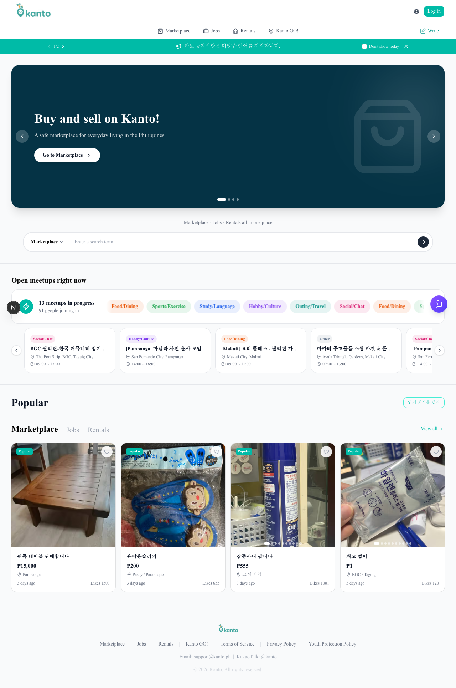
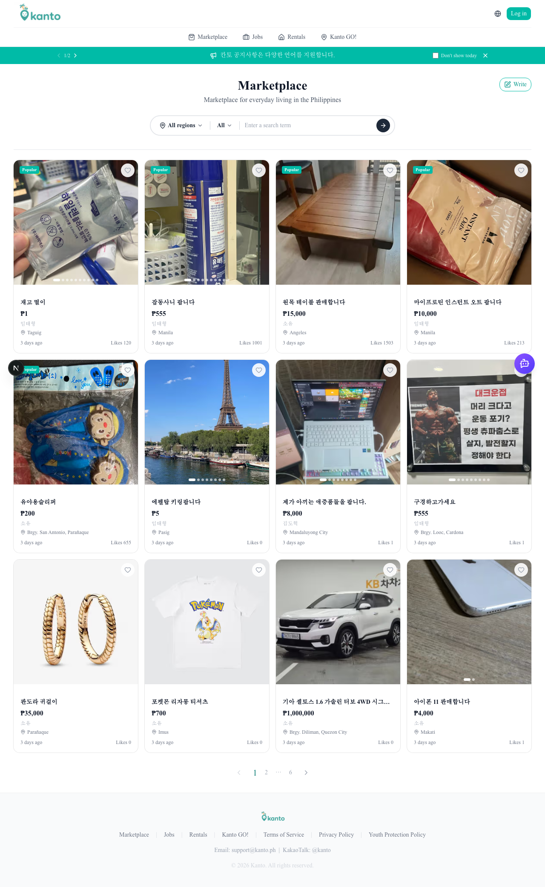
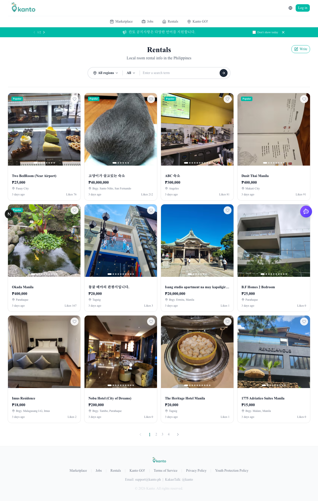
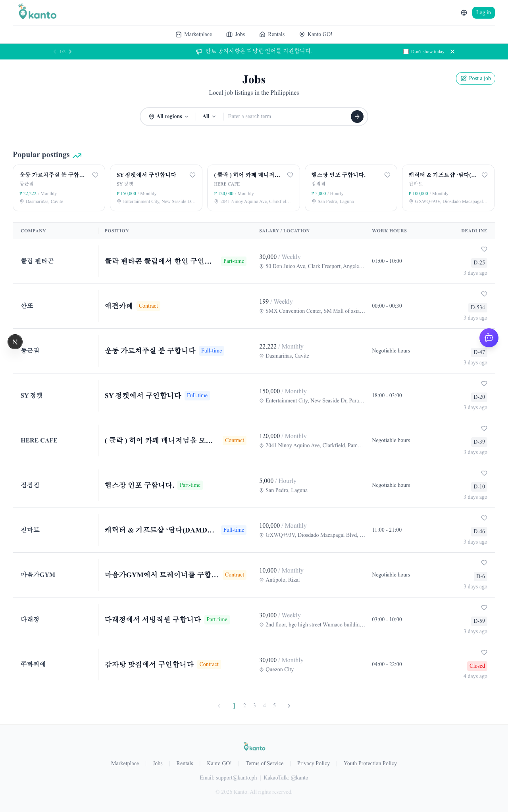
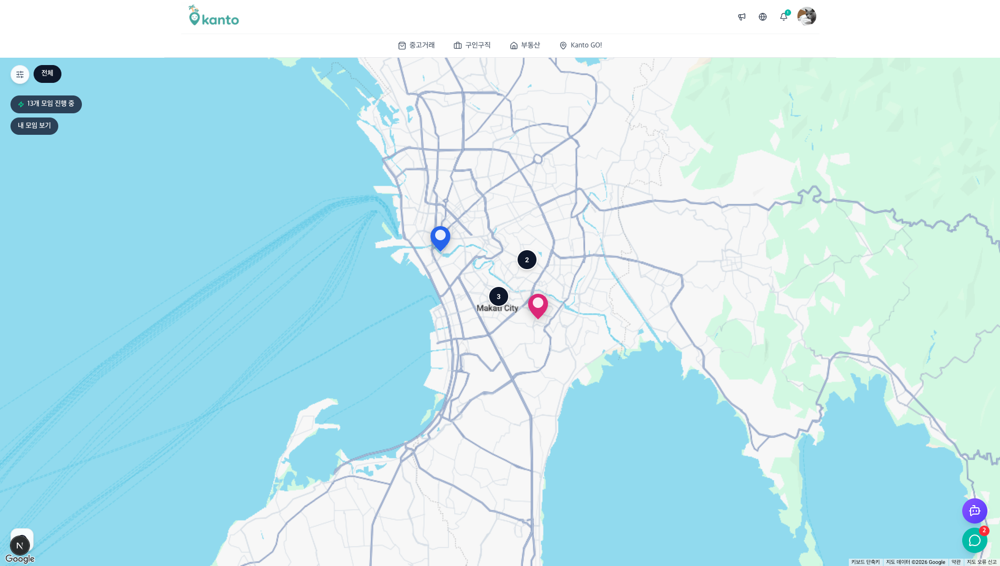
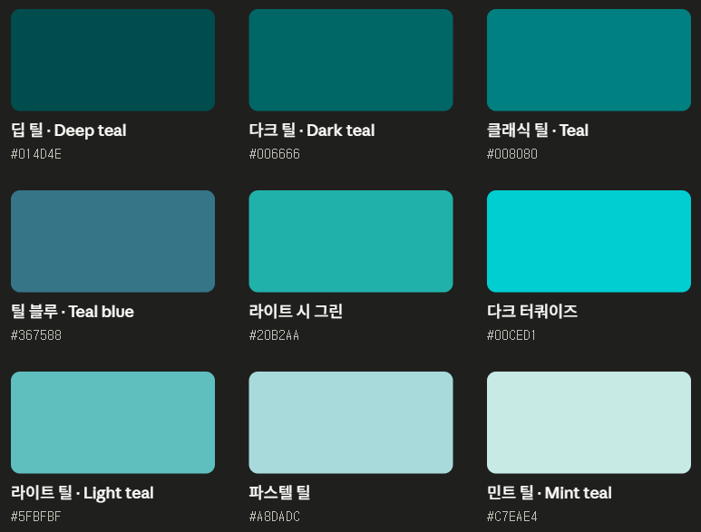
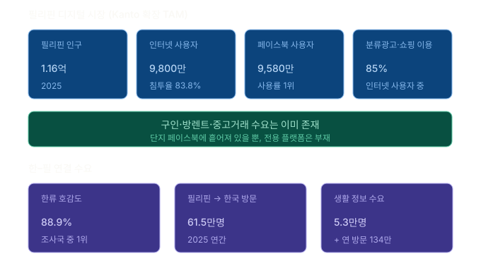
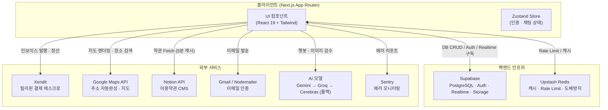
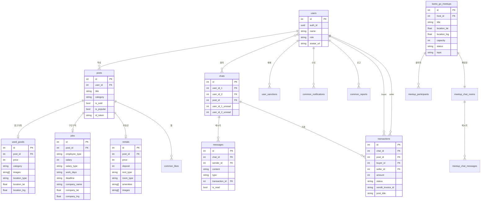

# Kanto

> 필리핀 생활 필수 플랫폼 — 중고거래·구인구직·부동산를 한 곳에서

## 🔗 링크

| 항목 | URL |
| ---- | --- |
| 라이브 데모 | [https://kanto-iota.vercel.app](https://kanto-iota.vercel.app) |
| 프로젝트 노션 | [Notion 기획 문서](https://app.notion.com/p/1-it-s-real-36e73873401a8099b037f045e2d2c9eb) |

> 테스트 계정 — ID: `asdf1234@naver.com` / PW: `asdf1234`

---

## 스크린샷

| 메인 피드                                     | 중고거래                                               |
| --------------------------------------------- | ------------------------------------------------------ |
|  |  |

| 부동산                                            | 구인구직                                         |
| ------------------------------------------------- | ------------------------------------------------ |
|  |  |

| 칸토고                                      |
| ------------------------------------------- |
|  |

---

## 개발 기간 및 팀원

| 항목 | 내용 |
| ---- | ---- |
| 개발 기간 | 2026.05.29 ~ 2026.07.06 (약 6주) |
| 팀 구성 | 프론트엔드 4인 |
| 배포 환경 | Vercel (main 브랜치 자동 배포) |

---

## 프로젝트 소개

프로젝트 Kanto는 필리핀에서 "우리 동네"라는 뜻을 가지고 있습니다.

필리핀 생활에 필요한 거래, 일자리, 주거 정보를 한곳에서 찾고 관리할 수 있는 신뢰도 높은 플랫폼을 목표로 시작했습니다.

구인구직, 부동산, 중고거래 정보는 여러 채널에 흩어져 있어 탐색과 비교가 어렵습니다. Kanto는 이 흐름을 체계적인 서비스로 묶어 사용자가 더 빠르고 안전하게 생활 정보를 찾도록 돕습니다.

## 중고거래 (Used Goods)

필리핀 현지에서 불필요한 물건을 팔거나 필요한 물건을 찾을 수 있는 중고 직거래 마켓입니다.

| 기능           | 설명                                                                                                    |
| -------------- | ------------------------------------------------------------------------------------------------------- |
| 상품 등록      | 제목·가격·카테고리·상태·위치·설명·이미지 최대 10장 업로드, AI 이미지 자동 검수                         |
| 카테고리 필터  | 가구 / 의류 / 전자기기 / 악세서리 / 유아용품 / 자동차 / 기타 — URL 파라미터 기반 필터 유지             |
| 상품 상태 표시 | 미개봉 / 가벼운 사용감 / 사용감 있음 / 기타 배지로 상태 명시                                           |
| 예약 · 판매완료 | 예약 중 배지 실시간 표시, 판매완료 시 상품 오버레이 처리                                                |
| 1:1 채팅       | 상세 페이지에서 바로 판매자에게 채팅 개시, 차단 사용자 채팅 시작 방지                                  |
| 안전결제       | Xendit 에스크로 인보이스 발행 → 구매자 결제 → 판매자 수령 확인 3단계 거래 흐름                         |
| 위치 기반 탐색 | 바랑가이·도시 단위 위치 표시, 근사 위치 지도 핀 제공                                                   |
| 관련 매물 추천 | 상세 페이지 하단에 같은 카테고리 관련 상품 캐러셀 자동 노출                                             |
| 찜 · 공유 · 신고 | 로그인 없이 공유, 로그인 시 찜 토글·신고 접수                                                         |

---

## 구인구직 (Job)

필리핀 현지 한인 커뮤니티를 위한 구인·구직 게시판입니다. 채용 공고를 올리거나 원하는 조건의 일자리를 검색할 수 있습니다.

| 기능           | 설명                                                                                                          |
| -------------- | ------------------------------------------------------------------------------------------------------------- |
| 공고 등록      | 2단계 폼으로 구성 — 1단계: 직무 조건, 2단계: 회사 정보                                                       |
| 고용 형태      | 정규직 / 계약직 / 파트타임 선택                                                                               |
| 급여 설정      | 시급 · 주급 · 월급 유형 선택, 금액 입력 또는 협의 표시                                                       |
| 근무 조건      | 근무 요일(평일·주말·매일 프리셋 또는 개별 선택), 출퇴근 시간 설정, 시간 협의 가능 체크박스                   |
| 우대 조건 태그 | 어학(한/영/따갈로그/중/일/통역), 체류(9G비자·영주권·배우자비자 등), 경력, 직군, 기타 — 다중 태그 선택        |
| 회사 정보      | 회사 로고·소개·업종·설립연도·직원수·웹사이트, Google Maps 주소 자동완성으로 회사 위치 지도 핀 설정           |
| 담당자 연락처  | 담당자 이름·직함·전화번호·이메일 등록, 지원자가 상세 페이지에서 바로 확인                                     |
| 마감일 관리    | 공고 마감일 설정, D-N / D-day / 마감 배지로 목록에서 시각적으로 구분                                         |
| 검색 · 필터    | 키워드 검색, 고용 형태·위치 필터, URL 파라미터 기반으로 공유 가능                                             |

---

## 부동산 (Rental)

필리핀 현지 숙소·방을 구하거나 임대 매물을 등록하는 부동산 게시판입니다.

| 기능            | 설명                                                                                                              |
| --------------- | ----------------------------------------------------------------------------------------------------------------- |
| 매물 등록       | 제목·가격·보증금·방 타입·최대 입주 인원·설명·이미지 업로드, AI 이미지 자동 검수                                  |
| 임대 유형       | 월세 / 매매 선택                                                                                                  |
| 방 타입         | 아파트 / 스튜디오 / 원룸 / 투룸 선택                                                                             |
| 편의시설 태그   | 주차·엘리베이터·에어컨·세탁기·냉장고·반려동물 허용·금고·TV·인터넷·수영장·헬스장·보안요원 — 12종 다중 선택        |
| 위치 설정       | Google Maps 장소 자동완성으로 정확한 주소 입력, 바랑가이·도시 단위 저장                                          |
| 이미지 캐러셀   | 상세 페이지에서 등록된 이미지 슬라이드 뷰어 제공                                                                 |
| 판매완료 처리   | 거래 완료 시 매물 오버레이로 숨김 처리, 삭제된 매물도 안전하게 숨김                                              |
| 관련 매물 추천  | 상세 페이지 하단에 같은 지역·방 타입 관련 매물 캐러셀 자동 노출                                                  |
| 찜 · 공유 · 신고 | 로그인 없이 공유, 로그인 시 찜 토글·신고 접수                                                                   |

---

## 칸토고 (Kanto Go)

**칸토고**는 Kanto의 지도 기반 번개모임 서비스입니다.

필리핀 현지에서 빠르게 사람을 모아 소규모 활동을 함께하고 싶을 때, 칸토고를 통해 지도에 모임 핀을 꽂고 주변 사람들을 즉시 초대할 수 있습니다.

| 기능          | 설명                                                                                    |
| ------------- | --------------------------------------------------------------------------------------- |
| 모임 생성     | Google Maps 위에서 원하는 장소를 선택해 번개모임을 개설, 주제·인원·시간 설정           |
| 지도 탐색     | 지도 위 핀과 클러스터로 주변 활성 모임을 한눈에 확인, 토픽 칩으로 빠른 필터링          |
| 실시간 채팅   | 참여자들 간 Supabase Realtime 기반 그룹 채팅, 신규 참여 시 즉시 채팅방 진입            |
| 참여 / 탈퇴   | 모임 상세 패널에서 원클릭 참여·탈퇴, 마감 인원 도달 시 자동 입장 차단                  |
| 신고 / 차단   | 모임 및 참여자 신고·차단으로 안전한 모임 환경 유지                                     |

## 대표 색상



대표적인 색상은 **Teal 계열**을 선택했습니다.

Teal 색상은 한때 필리핀의 바다 색상을 본 뒤 힐링을 받았던 기억이 있어 필리핀의 바다와 열대 해양 환경에서 영감을 받았습니다.

또한 Teal 색상은 자연을 상징하면서도 사람에게 높은 **신뢰와 성장, 공동체**를 상징하는 색상이기도 합니다.

필리핀의 생활 전반을 연결하는 라이프 플랫폼을 지향합니다.

## 구체적인 데이터



2025년 필리핀은 "세계 소셜 미디어 수도"로 꼽혔을 정도로 필리핀의 디지털 시장의 이용 시간은 매우 높지만 모두 페이스북 사용자로 흩어져 있고, 이러한 많은 수요를 감당할 전용 플랫폼이 없다는 점입니다.

---

## 조원별 담당 영역

### 박소유 [@soyupark1997](https://github.com/soyupark1997) — 팀장

| 영역          | 내용                                                                                                                                                                                                                                                    | 규모 | 난이도 | 총점 |
| ------------- | ------------------------------------------------------------------------------------------------------------------------------------------------------------------------------------------------------------------------------------------------------- | :--: | :----: | :--: |
| 프로젝트 초석 | 프로젝트 초기 세팅 및 환경 구성, 헤더 UI 전체 구현(알림 드롭다운·로그아웃 모달·로그인 플래시 제거·계정 정지 알림), 찜·공유·신고 공통 컴포넌트 설계, `ImageWithFallback`·`LoginRequiredModal`·`formatPrice`·`formatDate` 유틸 통합, 검색창 공통 컴포넌트 | 대(3) | 중(2) | 5 |
| 구인구직      | 구인구직 글쓰기 페이지 구현 초석 및 `useCreateJobForm` 훅 분리, 상세 페이지 UI 전면 개편, 수정·삭제 공통화(`VerifyAuthor`) 및 구인구직 수정 페이지 추가                                                                                                 | 대(3) | 중(2) | 5 |
| 중고거래      | 중고거래 목록 페이지·카드 컴포넌트 초석 구현                                                                                                                                                                                                            | 소(1) | 하(1) | 2 |
| 상세 페이지   | 부동산·중고거래 상세 페이지 UI 개편, 전 카테고리 관련 매물 추천 캐러셀                                                                                                                                                                                  | 중(2) | 하(1) | 3 |
| 결제          | Xendit Disbursement 연동, 정산 계좌 등록, 결제 중복 처리·수령 확인 동시 요청 방지, 판매자 계좌 미등록 차단, 관리자 결제내역 관리·KPI 대시보드                                                                                                           | 대(3) | 상(3) | 6 |
| 보안 · 인프라 | Supabase 타입 자동생성 파이프라인, Upstash Redis 도입, RLS anon 공개 정보 노출 차단(drop policy), 도배 방지 Server Action(check+insert 원자적), 감사 로그 신뢰성 개선(`await` 누락 수정), CI lint 게이트 구축                                           | 대(3) | 상(3) | 6 |
| 칸토고 · 기타 | 칸토고 내 모임 보기, 지도 UI 개선, Google Maps APIProvider 싱글턴 리팩터링, 번역 API fallback, Terms 5개 페이지 SSR 전환                                                                                                                                | 중(2) | 중(2) | 4 |

**총점 합계: 31점** (규모 17 + 난이도 14)

---

### 김도혁 [@DoHyuk-Centric](https://github.com/DoHyuk-Centric)

| 영역               | 내용                                                                                                                                                                                                                                 | 규모 | 난이도 | 총점 |
| ------------------ | ------------------------------------------------------------------------------------------------------------------------------------------------------------------------------------------------------------------------------------ | :--: | :----: | :--: |
| 채팅 초석          | 채팅 타입 정의·Zustand 스토어 설계, `@supabase/ssr` 도입, Supabase Realtime 기반 1:1 채팅방 전체 구현(실시간 메시지·읽음 처리·도배 방지·메시지 페이지네이션·날짜 구분선), Realtime 훅 분리, 낙관적 메시지 업데이트, 플로팅 채팅 위젯 | 대(3) | 상(3) | 6 |
| 로그인 · 인증      | Redis + Upstash로 IP 기반 로그인 실패 5회 이상 시 5분 차단, 회원가입 컴포넌트 분리·약관 Notion CMS 연동, 다른 기기 로그인 시 기존 세션 즉시 로그아웃, 회원 탈퇴 API 및 Supabase Admin 클라이언트                                     | 중(2) | 중(2) | 4 |
| 공통 디자인 시스템 | `ContentCard`·`EmptyState` 공통 컴포넌트, `page-container`·`page-title`·`btn-primary` CSS 클래스 체계 구축, teal 버튼 shadcn variant 통합, WCAG 2.1 AA 접근성 전면 개선                                                              | 대(3) | 중(2) | 5 |
| 이용약관 초석      | Notion CMS API 연동·인메모리 캐시, 약관 레이아웃·탭 네비게이션·스켈레톤 초기 설계, `TermsContent` 공통 컴포넌트 분리                                                                                                                 | 중(2) | 중(2) | 4 |
| 메인 페이지 초석   | 히어로 섹션·인기 목록·메인 검색바 전체 구현, `MainCard` 재사용 컴포넌트, 카테고리 필터 모달, 무한 캐러셀 자동 애니메이션                                                                                                             | 대(3) | 중(2) | 5 |
| 검색 · 필터 초석   | URL 파라미터 기반 검색·필터 전 목록 페이지 공통화(중고거래·구인구직·부동산), 공통 URL 유틸리티                                                                                                                                       | 중(2) | 상(3) | 5 |
| 프로필             | 서버 컴포넌트 전환, 활동 통계·거래내역 페이지네이션·개설한/참여중인 모임 목록, 알림 설정·관심 카테고리 Supabase 연동, 프로필 사진 즉시 저장 UX                                                                                       | 대(3) | 중(2) | 5 |
| 관리자             | 감사 로그·`super_admin` 권한 체계 마이그레이션, 인기 공고 설정, 게시글 소프트 딜리트, 금칙어·스팸 설정 DB 연동, KTS·KPPS 신뢰 점수 시스템 DB 마이그레이션                                                                            | 중(2) | 상(3) | 5 |
| SEO · 성능         | SEO 메타데이터·OG 이미지·JSON-LD 구조화 데이터, 이미지 WebP 변환으로 Supabase Storage 트래픽 최적화                                                                                                                                  | 중(2) | 하(1) | 3 |
| 공지 국제화        | 공지사항 MyMemory 번역 API 연동 — 등록 시 한/영/필 자동 번역·저장                                                                                                                                                                    | 소(1) | 하(1) | 2 |

**총점 합계: 44점** (규모 23 + 난이도 21)

---

### 이동근 [@dongkeun99](https://github.com/dongkeun99)

| 영역               | 내용                                                                                                                                                                | 규모 | 난이도 | 총점 |
| ------------------ | ------------------------------------------------------------------------------------------------------------------------------------------------------------------- | :--: | :----: | :--: |
| 회원가입 초석      | 회원가입 폼 Supabase DB 연결, 동의 체크박스·정규식 유효성 검사, 본인인증 모달·프로필 본인인증 기능, 비밀번호 재설정                                                 | 중(2) | 중(2) | 4 |
| 국제화 초석        | `next-intl` 도입 및 전체 서비스 3개국어(한/영/필) 구축 — 전 페이지·컴포넌트·훅·모달 번역 키 적용, 약관·비밀번호 찾기·칸토고 다국어 처리                             | 대(3) | 중(2) | 5 |
| 중고거래 상세 초석 | 중고거래 상세 페이지 최초 구현, 수정·삭제 버튼 구현, 구인구직·부동산 레이아웃 통일                                                                                  | 중(2) | 하(1) | 3 |
| 부동산 글쓰기 초석 | 부동산 글쓰기 페이지 전체 제작                                                                                                                                      | 중(2) | 하(1) | 3 |
| 채팅               | 미읽음 카운트 버그 수정, 연속 메시지 표시, 차단 사용자 채팅 시작 방지, 모임 채팅 읽음 처리 UX, 알림 not_null 마이그레이션                                           | 소(1) | 중(2) | 3 |
| 상세 페이지        | 삭제 매물 숨김·거래완료 오버레이, 구인구직 회사 위치 지도 핀, 칸토고 지도 클러스터링·반응형 패널                                                                    | 중(2) | 상(3) | 5 |
| Supabase · 성능    | 인덱스·RLS initplan 최적화 마이그레이션, 쿼리 병렬화, 번들 축소(Sentry·react-markdown 지연 로딩), LCP priority·AVIF 포맷·이미지 캐시 TTL, DB 페이지네이션 성능 개선 | 대(3) | 상(3) | 6 |
| 관리자             | 유저 관리 탭 페이지, 게시글·회원 상세 드로어, 신고 처리 동선 연결, 제재 일괄 처리                                                                                   | 중(2) | 하(1) | 3 |
| 회원 기능          | 정지 해제 시 망고지수 복원, 계좌 저장 버그 수정, 페이스북 로그인 문제 해결                                                                                          | 소(1) | 중(2) | 3 |

**총점 합계: 35점** (규모 18 + 난이도 17)

---

### 임태형 [@THLIMM](https://github.com/THLIMM)

| 영역                 | 내용                                                                                                                                                                                          | 규모 | 난이도 | 총점 |
| -------------------- | --------------------------------------------------------------------------------------------------------------------------------------------------------------------------------------------- | :--: | :----: | :--: |
| 로그인 초석          | 로그인 페이지(shadcn UI) 최초 구현, 카카오·구글 소셜 로그인 연동 및 Supabase 유저 저장, auth/callback 처리, Supabase 서버 클라이언트 유틸 단일화(`createSupabaseServerClient → createClient`) | 중(2) | 중(2) | 4 |
| 결제 · 안전거래 초석 | Xendit 인보이스 클라이언트 및 결제 트랜잭션 타입 설계, 결제 Server Action, 채팅 내 안전결제 UI 및 Supabase Realtime 동기화, 거래 상태 전환 시스템 메시지 자동 발송, 거래 완료 후 후기 작성    | 대(3) | 상(3) | 6 |
| 칸토고 초석          | 번개모임 기획서 작성 및 전체 구현 — 지도 기반 생성·참여, 그룹 채팅, 신고·차단(`kanto_go_meetups`·`kanto_go_group_chat` 마이그레이션), Supabase Realtime 동기화, 장소 자동완성                 | 대(3) | 상(3) | 6 |
| 중고거래 글쓰기 초석 | 중고거래 글쓰기 페이지 구현, `useImageUpload` 훅 및 `ImageUploadField` 공통 컴포넌트 설계, Supabase Storage 이미지 업로드 연동                                                                | 중(2) | 중(2) | 4 |
| 관리자 초석          | 대시보드 구축(RLS 우회 `supabaseAdmin` 아키텍처), 신고 관리 페이지, 신고-제재 데이터 정합성 마이그레이션(FK 연결)                                                                             | 대(3) | 상(3) | 6 |
| 채팅 · 알림          | 채팅방 신고·차단(`user_blocks` 마이그레이션), 알림 중복 누적·읽음 타이밍 버그 수정, 정지 배너 실시간 반영                                                                                     | 소(1) | 중(2) | 3 |
| 기타                 | 상세 페이지 Google Maps 위치 지도 추가, 부동산 목록 페이지 구현, 목록 UI 개선 및 필터, AI 이미지 검수 기능                                                                                    | 중(2) | 중(2) | 4 |

**총점 합계: 33점** (규모 16 + 난이도 17)

---

## 관리자 대시보드 (Admin)

`super_admin` 권한을 가진 운영자만 접근 가능한 전용 관리 시스템입니다.

| 페이지            | 경로                              | 설명                                                                                               |
| ----------------- | --------------------------------- | -------------------------------------------------------------------------------------------------- |
| 대시보드          | `/admin`                          | KPI 카드(총 회원·활성 사용자·신규 가입·총 게시글·총 거래금액), 트렌드 차트, 신고 현황 요약        |
| 글 관리           | `/admin/posts`                    | 전 카테고리 게시글 목록, 소프트 딜리트, 게시글 상세 드로어, 신고 연결 처리, 일괄 삭제             |
| 유저 관리         | `/admin/users`                    | 회원 목록·검색, 7일/30일/영구 정지 개별·일괄 제재, 정지 해제, 회원 상세 드로어(게시글·신고 이력) |
| 신고 내역         | `/admin/reports`                  | 게시글·사용자 신고 목록, 신고 유형별 분류, 처리 상태 관리, 미처리 신고 배지 실시간 표시           |
| 결제 관리         | `/admin/payments`                 | 결제내역 전체 조회, 결제 상태(대기·완료·환불) 필터                                                |
| 번개모임 관리     | `/admin/go`                       | 칸토고 모임 현황 조회 및 관리                                                                      |
| 채팅 기록         | `/admin/chats`                    | 채팅방 목록 검색, 메시지 내용 열람                                                                 |
| 운영 관리         | `/admin/operation`                | 하위 메뉴 모음                                                                                     |
| ㄴ 공지사항       | `/admin/operation/notices`        | 공지 등록·수정·삭제, 헤더 미리보기, 한/영/필 자동 번역 저장                                       |
| ㄴ 금칙어 설정    | `/admin/operation/content`        | 금칙어 룰 등록·수정, 기존 게시물에서 금칙어 포함 게시글 검색                                      |
| ㄴ 스팸 설정      | `/admin/operation/content`        | 스팸 탐지 설정, 제재 템플릿 관리                                                                   |
| ㄴ 인기 공고 설정 | `/admin/operation/popular-jobs`   | 메인 페이지에 노출할 인기 구인 공고 수동 지정                                                      |
| ㄴ 권한 관리      | `/admin/operation/permissions`    | 관리자 계정 생성·목록 조회, 팀별 권한 체계 관리                                                   |
| ㄴ 감사 로그      | `/admin/operation/audit-logs`     | 관리자 액션 전체 이력 조회, 액션 유형·날짜 필터, 상세 드로어                                      |
| ㄴ 모니터링       | `/admin/operation/monitoring`     | 서비스 통계·성능·에러 탭으로 구성된 운영 모니터링 대시보드                                        |

## 기여도

> **공식**: 기여도 = (정량 점수 × 0.5) + (역할 난이도 × 0.5)
>
> - **정량 점수**: 기능 난이도 점수 × 참여 비율 합산 → 팀 전체 합 대비 비율(%)
> - **역할 난이도**: 본인이 담당한 기능 중 최고 난이도 점수 → 팀 전체 합 대비 비율(%)

### 난이도 등급

| 등급 | 점수 | 기준 |
| :---: | :---: | ---- |
| S | 5 | 외부 시스템 연동 + 돈/보안이 걸린 기능. 실패 시 서비스 신뢰도 직결 |
| A | 4 | 복잡한 로직/아키텍처 설계 필요. 디버깅 난이도 높음 |
| B | 3 | 일반적인 CRUD보다 복잡. 상태관리·비동기 처리 등 고려사항 많음 |
| C | 2 | 표준적인 기능 구현. 패턴이 정형화되어 있음 |
| D | 1 | 단순 UI, 정적 페이지, 설정성 작업 |

### 기능별 참여 비율 및 획득 점수

| 기능 | 등급 | 점수 | 박소유 | 김도혁 | 이동근 | 임태형 |
| ---- | :---: | :---: | :---: | :---: | :---: | :---: |
| Xendit 에스크로 결제 (인보이스→보류→지급) | S | 5 | 40% | - | - | 60% |
| RLS 보안 설계 + 성능 최적화 (InitPlan) | S | 5 | 50% | - | 50% | - |
| AI 챗봇 (RAG + 3단 모델 폴백) | A | 4 | 30% | 70% | - | - |
| AI 이미지 모더레이션 (Llama 4 Scout Vision) | A | 4 | - | - | - | 100% |
| 망고지수 신뢰도 시스템 (recalculate_kts) | A | 4 | - | 70% | 30% | - |
| 실시간 1:1 채팅 + 미읽음 카운트 | A | 4 | - | 60% | 15% | 25% |
| Google Maps 연동 + 필리핀 지역 데이터 (PSGC) | B | 3 | 30% | - | 30% | 40% |
| 이미지 최적화 파이프라인 (Canvas→WebP) | B | 3 | - | 40% | 30% | 30% |
| 중고거래 / 구인구직 / 부동산 CRUD | B | 3 | 30% | 20% | 25% | 25% |
| Kanto GO! 번개모임 (지도핀+바텀시트) | B | 3 | 20% | - | 20% | 60% |
| 헤더 UI + 공통 컴포넌트 | B | 3 | 60% | 40% | - | - |
| 관련 매물 추천 캐러셀 | B | 3 | 100% | - | - | - |
| 디자인 시스템 + WCAG 2.1 접근성 | B | 3 | - | 100% | - | - |
| SEO + OG + JSON-LD 구조화 데이터 | B | 3 | - | 100% | - | - |
| 약관 Notion CMS + 공지 다국어 번역 | B | 3 | 30% | 70% | - | - |
| 프로필 페이지 (내 정보 + 거래 내역) | B | 3 | - | 100% | - | - |
| 소셜 로그인 + OAuth 콜백 처리 | B | 3 | - | - | - | 100% |
| 거래 완료 후 리뷰 시스템 | B | 3 | - | - | - | 100% |
| 로그인 보안 (Rate Limit + 다기기 세션) | B | 3 | - | 100% | - | - |
| 회원가입 + 본인인증 + 비밀번호 재설정 | B | 3 | - | - | 100% | - |
| 쿼리 병렬화 + DB 인덱스 성능 튜닝 | B | 3 | - | - | 100% | - |
| i18n 3개국어 (next-intl) | C | 2 | - | - | 100% | - |
| 관리자 대시보드 | C | 2 | 10% | 35% | 20% | 35% |
| 메인 / 검색 / 페이지네이션 UI | C | 2 | 10% | 70% | 20% | - |
| 배포 / 환경변수 / Sentry 세팅 | C | 2 | 60% | - | 40% | - |

### 최종 기여도

| 기능 | 점수 | 박소유 | 김도혁 | 이동근 | 임태형 |
| ---- | :---: | :---: | :---: | :---: | :---: |
| Xendit 에스크로 결제 | 5 | 2.00 | - | - | 3.00 |
| RLS 보안 + 성능 최적화 | 5 | 2.50 | - | 2.50 | - |
| AI 챗봇 | 4 | 1.20 | 2.80 | - | - |
| AI 이미지 모더레이션 | 4 | - | - | - | 4.00 |
| 망고지수 신뢰도 | 4 | - | 2.80 | 1.20 | - |
| 실시간 1:1 채팅 | 4 | - | 2.40 | 0.60 | 1.00 |
| Google Maps + PSGC | 3 | 0.90 | - | 0.90 | 1.20 |
| 이미지 최적화 파이프라인 | 3 | - | 1.20 | 0.90 | 0.90 |
| 중고거래/구인구직/부동산 CRUD | 3 | 0.90 | 0.60 | 0.75 | 0.75 |
| Kanto GO! 번개모임 | 3 | 0.60 | - | 0.60 | 1.80 |
| 헤더 UI + 공통 컴포넌트 | 3 | 1.80 | 1.20 | - | - |
| 관련 매물 추천 캐러셀 | 3 | 3.00 | - | - | - |
| 디자인 시스템 + WCAG 2.1 | 3 | - | 3.00 | - | - |
| SEO + OG + JSON-LD | 3 | - | 3.00 | - | - |
| 약관 Notion CMS + 공지 번역 | 3 | 0.90 | 2.10 | - | - |
| 프로필 페이지 | 3 | - | 3.00 | - | - |
| 소셜 로그인 + OAuth 콜백 | 3 | - | - | - | 3.00 |
| 거래 완료 후 리뷰 | 3 | - | - | - | 3.00 |
| 로그인 보안 (Rate Limit + 다기기) | 3 | - | 3.00 | - | - |
| 회원가입 + 본인인증 + 비밀번호 | 3 | - | - | 3.00 | - |
| 쿼리 병렬화 + DB 성능 튜닝 | 3 | - | - | 3.00 | - |
| i18n 3개국어 | 2 | - | - | 2.00 | - |
| 관리자 대시보드 | 2 | 0.20 | 0.70 | 0.40 | 0.70 |
| 메인/검색/페이지네이션 UI | 2 | 0.20 | 1.40 | 0.40 | - |
| 배포/환경변수/Sentry | 2 | 1.20 | - | 0.80 | - |
| **정량 점수 합계** | **79** | **15.40** | **27.20** | **17.05** | **19.35** |
| **정량 점수 비율** | | **19.5%** | **34.4%** | **21.6%** | **24.5%** |
| **역할 난이도 비율** | | **26.3%** | **21.1%** | **26.3%** | **26.3%** |
| **최종 기여도** | | **22.9%** | **27.7%** | **23.9%** | **25.4%** |

---

## 기술 스택

### Frontend

| 분류       | 기술                                 | 선택 이유                                                                       |
| ---------- | ------------------------------------ | ------------------------------------------------------------------------------- |
| 프레임워크 | Next.js 16 (App Router), React 19    | Server Actions로 민감 로직을 서버에 격리, SSR로 초기 로딩 최적화                |
| 언어       | TypeScript                           | 4인 협업 시 타입 계약으로 인터페이스 오류 조기 차단                             |
| 스타일링   | Tailwind CSS 4, shadcn/ui, Radix UI  | 디자인 시스템 없이 빠른 일관성 확보, shadcn은 접근성 기본 제공                  |
| 상태관리   | Zustand                              | Redux 대비 보일러플레이트 최소화, 인증·채팅처럼 전역이지만 단순한 상태에 적합   |
| 국제화     | next-intl (한국어 / 영어 / 필리핀어) | 서버·클라이언트 양쪽에서 동작, App Router 라우팅과 쿠키 기반 locale 유지에 최적 |
| 아이콘     | Lucide React                         | —                                                                               |
| 마크다운   | react-markdown, remark-gfm           | —                                                                               |

### Backend & 인프라

| 분류                | 기술                         | 선택 이유                                                                   |
| ------------------- | ---------------------------- | --------------------------------------------------------------------------- |
| 데이터베이스 / 인증 | Supabase (PostgreSQL + Auth) | RLS로 행 단위 접근 제어, Realtime으로 별도 소켓 서버 없이 1:1 채팅 구현     |
| 결제                | Xendit (Philippines Peso)    | 필리핀 현지 결제 게이트웨이, 에스크로 인보이스 발행 지원                    |
| 캐싱 / 레이트리밋   | Upstash Redis                | Serverless 환경에서 연결 유지 비용 없이 슬라이딩 윈도우 방식 도배 방지 구현 |
| 이메일              | Nodemailer (Gmail)           | —                                                                           |
| 문서 관리           | Notion API                   | 약관 수정을 코드 배포 없이 Notion에서 직접 관리                             |

---

## 시스템 아키텍처


```mermaid
graph TD
    subgraph Client["클라이언트 (Next.js App Router)"]
        UI["UI 컴포넌트\n(React 19 + Tailwind)"]
        Store["Zustand Store\n(인증 · 채팅 상태)"]
    end

    subgraph Backend["백엔드 인프라"]
        Supabase["Supabase\nPostgreSQL · Auth · Realtime · Storage"]
        Redis["Upstash Redis\n캐시 · Rate Limit · 도배방지"]
    end

    subgraph External["외부 서비스"]
        Xendit["Xendit\n필리핀 결제 에스크로"]
        GMaps["Google Maps API\n주소 자동완성 · 지도"]
        Notion["Notion API\n이용약관 CMS"]
        Gmail["Gmail / Nodemailer\n이메일 인증"]
        AI["AI 모델\nGemini → Groq → Cerebras (폴백)"]
        Sentry["Sentry\n에러 모니터링"]
    end

    UI <-->|"DB CRUD / Auth / Realtime 구독"| Supabase
    UI <-->|"Rate Limit / 캐시"| Redis
    UI -->|"인보이스 발행 · 정산"| Xendit
    UI -->|"지도 렌더링 · 장소 검색"| GMaps
    UI -->|"약관 Fetch (5분 캐시)"| Notion
    UI -->|"이메일 발송"| Gmail
    UI -->|"챗봇 · 이미지 검수"| AI
    UI -->|"에러 리포트"| Sentry
```

---

## ERD


```mermaid
erDiagram
    users ||--o{ posts : "작성"
    users }o--o{ chats : "참여"
    users ||--o{ user_sanctions : "제재"
    users ||--o{ common_notifications : "수신"
    users ||--o{ common_reports : "신고"

    posts ||--o| used_goods : "중고거래"
    posts ||--o| jobs : "구인구직"
    posts ||--o| rentals : "부동산"
    posts ||--o{ common_likes : "찜"

    chats ||--o{ messages : "메시지"
    chats ||--o{ transactions : "거래"
    transactions }o--|| users : "buyer"
    transactions }o--|| users : "seller"

    kanto_go_meetups ||--o{ meetup_participants : "참여자"
    kanto_go_meetups ||--|| meetup_chat_rooms : "채팅방"
    meetup_chat_rooms ||--o{ meetup_chat_messages : "메시지"

    users {
        int id PK
        uuid auth_id
        string name
        string role
        string avatar_url
    }
    posts {
        int id PK
        int user_id FK
        string title
        string category
        bool is_sold
        bool is_popular
        string id_token
    }
    used_goods {
        int id PK
        int post_id FK
        int price
        string category
        string[] images
        string location_type
        float location_lat
        float location_lng
    }
    jobs {
        int id PK
        int post_id FK
        string employee_type
        int salary
        string salary_type
        string work_days
        string deadline
        string company_name
        float company_lat
        float company_lng
    }
    rentals {
        int id PK
        int post_id FK
        int price
        int deposit
        string rent_type
        string room_type
        string[] amenities
        string[] images
    }
    chats {
        int id PK
        int user_id_1 FK
        int user_id_2 FK
        int post_id FK
        int user_id_1_unread
        int user_id_2_unread
    }
    messages {
        int id PK
        int chat_id FK
        int sender_id FK
        string content
        string type
        int transaction_id FK
        bool is_read
    }
    transactions {
        int id PK
        int chat_id FK
        int post_id FK
        int buyer_id FK
        int seller_id FK
        int amount
        string status
        string xendit_invoice_id
        string post_title
    }
    kanto_go_meetups {
        int id PK
        int host_id FK
        string title
        float location_lat
        float location_lng
        int capacity
        string status
        string topic
    }
```

---

## 주요 기능

- **중고거래**: 상품 등록·검색·카테고리 필터, 이미지 업로드, 안전결제(에스크로)
- **구인구직**: 채용 공고 등록·검색, 직종·지역 필터, 지원자 연락처 제공
- **부동산**: 숙소·방 등록, 방 타입·편의시설·위치 기반 검색
- **칸토고 (번개모임)**: Google Maps 기반 지도에서 번개모임 생성·참여, 실시간 그룹 채팅, 토픽 필터·클러스터 핀
- **실시간 채팅**: 판매자-구매자 간 1:1 채팅, 채팅 내 결제 요청
- **안전결제**: Xendit 기반 인보이스 발행, 거래 상태 추적
- **리뷰 시스템**: 거래 완료 후 상대방 평가
- **알림**: 채팅·댓글·게시글 알림, 사용자별 알림 설정
- **신고 / 제재**: 부적절한 콘텐츠·사용자 신고, 관리자 제재 처리
- **다국어 지원**: 한국어·영어·필리핀어 전환 (쿠키 기반 유지)
- **관리자 대시보드**: 사용자·게시글·채팅·신고 관리, KPI 통계

## 주요 페이지

### 사용자

| 경로              | 설명                                     |
| ----------------- | ---------------------------------------- |
| `/main`           | 메인 피드 (검색, 히어로 배너, 인기 상품) |
| `/login`          | 이메일/패스워드 로그인                   |
| `/signup`         | 회원가입                                 |
| `/profile`        | 프로필·알림 설정·인증 상태               |
| `/notifications`  | 알림 목록                                |
| `/favorites`      | 찜 목록 (카테고리별 탭)                  |
| `/myposts`        | 내 게시글 관리                           |
| `/usedgoods`      | 중고거래 목록                            |
| `/usedgoods/[id]` | 중고상품 상세                            |
| `/job`            | 구인구직 목록                            |
| `/job/[id]`       | 구인공고 상세                            |
| `/rental`         | 부동산 목록                              |
| `/rental/[id]`    | 방 상세                                  |
| `/go`             | 칸토고 — 지도 기반 번개모임 목록·생성   |
| `/payment/return` | 결제 완료/실패                           |
| `/terms/[type]`   | 이용약관·개인정보처리방침                |

### 관리자

| 경로             | 설명                       |
| ---------------- | -------------------------- |
| `/admin`                           | 대시보드 (KPI, 트렌드, 신고 현황)  |
| `/admin/users`                     | 사용자 관리·제재               |
| `/admin/posts`                     | 게시글 관리                    |
| `/admin/reports`                   | 신고 처리                      |
| `/admin/payments`                  | 결제 내역 관리                 |
| `/admin/go`                        | 번개모임 관리                  |
| `/admin/chats`                     | 채팅 기록 열람                 |
| `/admin/operation`                 | 운영 관리 (공지·금칙어·권한·로그·모니터링) |

## 프로젝트 구조

```
src/
├── app/
│   ├── (user)/                        # 사용자 페이지
│   │   ├── main/                      # 메인 피드 (히어로, 인기 목록, 검색)
│   │   ├── login/                     # 이메일 · 소셜 로그인
│   │   ├── signup/                    # 회원가입
│   │   ├── profile/                   # 내 프로필 · 알림 설정 · 인증
│   │   ├── user/[id]/                 # 타 사용자 프로필
│   │   ├── create/                    # 통합 글쓰기 (카테고리 선택)
│   │   ├── usedgoods/                 # 중고거래 목록
│   │   │   ├── [id]/                  # 상세 · 수정
│   │   │   └── create/               # 글쓰기
│   │   ├── job/                       # 구인구직 목록
│   │   │   ├── [id]/                  # 상세 · 수정
│   │   │   └── create/               # 글쓰기
│   │   ├── rental/                    # 부동산 목록
│   │   │   ├── [id]/                  # 상세 · 수정
│   │   │   └── create/               # 글쓰기
│   │   ├── go/                        # 칸토고 (지도 기반 번개모임)
│   │   ├── favorites/                 # 찜 목록
│   │   ├── myposts/                   # 내 게시글
│   │   ├── notifications/             # 알림 목록
│   │   ├── payment/return/            # 결제 완료 · 실패 콜백
│   │   └── terms/[type]/             # 이용약관 (Notion CMS)
│   │
│   ├── (admin)/                       # 관리자 페이지
│   │   └── admin/
│   │       ├── (대시보드)/            # KPI · 트렌드 · 신고 현황
│   │       ├── users/[id]/           # 유저 관리 · 제재
│   │       ├── posts/                 # 게시글 관리
│   │       ├── reports/               # 신고 처리
│   │       ├── payments/              # 결제 내역
│   │       ├── chats/[id]/           # 채팅 기록
│   │       ├── go/                    # 번개모임 관리
│   │       └── operation/
│   │           ├── notices/           # 공지사항 (다국어 자동 번역)
│   │           ├── content/           # 금칙어 · 스팸 설정
│   │           ├── popular-jobs/      # 인기 공고 수동 지정
│   │           ├── permissions/       # 관리자 권한 관리
│   │           ├── audit-logs/        # 감사 로그
│   │           ├── monitoring/        # 성능 · 통계 · 에러 모니터링
│   │           └── maintenance/       # 서비스 점검 설정
│   │
│   ├── api/                           # API 라우트
│   │   ├── admin/                     # 공지·금칙어·스팸·인기공고 관리
│   │   ├── ai/chat/                   # AI 챗봇 (Gemini → Groq → Cerebras)
│   │   ├── auth/reset-password/       # 비밀번호 재설정
│   │   ├── chat/[id]/                 # 채팅방 메시지
│   │   ├── login/                     # 로그인 Rate Limit (Redis)
│   │   ├── moderate-image/            # 이미지 AI 검수 (Groq Vision)
│   │   ├── payment/xendit/webhook/    # Xendit 결제 웹훅
│   │   ├── posts/rate-check/          # 도배 방지
│   │   ├── posts/cleanup/             # 만료 게시글 정리
│   │   ├── profile/verification/      # 본인 인증
│   │   ├── terms/                     # 약관 (Notion, 캐시 포함)
│   │   └── user/                      # 유저 정보
│   │
│   └── auth/callback/                 # OAuth 콜백 처리
│
├── components/
│   ├── common/
│   │   ├── header/                    # 헤더 (알림 드롭다운 · 로그아웃)
│   │   ├── chat/                      # 플로팅 채팅 위젯 · 채팅 패널
│   │   └── aichatbot/                 # AI 챗봇 UI
│   ├── go/                            # 칸토고 전용 컴포넌트 (지도 핀 · 모임 패널 · 그룹 채팅)
│   └── ui/                            # shadcn/ui 기본 컴포넌트
│
├── hooks/
│   ├── chat/                          # 채팅 Realtime 훅
│   ├── go/                            # 번개모임 · 그룹 채팅 Realtime 훅
│   ├── profile/                       # 프로필 관련 훅
│   └── usedgoods/                     # 중고거래 관련 훅
│
├── services/                          # Supabase 쿼리 · 비즈니스 로직
│   ├── admin/                         # 관리자 CRUD
│   ├── chat/                          # 채팅방 · 메시지
│   ├── go/                            # 모임 · 그룹 채팅
│   ├── job/                           # 구인구직
│   ├── main/                          # 메인 피드
│   ├── notion/                        # 약관 Fetch
│   ├── payment/                       # 에스크로 거래
│   ├── profile/                       # 계정 설정
│   ├── rental/                        # 부동산
│   ├── review/                        # 리뷰 · 평점
│   ├── usedGoods/                     # 중고거래
│   └── user/                          # 유저 프로필
│
├── store/                             # Zustand 전역 상태
│   ├── authStore.ts                   # 인증 · 유저 정보
│   ├── chatStore.ts                   # 채팅 UI 상태
│   └── goUiStore.ts                   # 칸토고 UI 상태
│
├── lib/                               # 외부 클라이언트 초기화
│   ├── supabase.ts                    # Supabase 클라이언트
│   ├── supabaseAdmin.ts               # Supabase Admin (서버 전용)
│   ├── xendit.ts                      # Xendit 결제 API
│   ├── translate.ts                   # MyMemory 번역 API
│   └── moderation/                    # 이미지 AI 검수 (Groq Vision)
│
├── utils/                             # 유틸리티 함수
│   ├── optimizeImage.ts               # Canvas WebP 변환
│   ├── idCipher.ts                    # URL ID 암호화
│   ├── format.ts                      # 날짜 · 가격 포맷
│   └── supabase/                      # SSR용 Supabase 클라이언트
│
├── type/                              # TypeScript 타입 정의
│   ├── supabase.ts                    # 자동 생성 (npm run gen:types)
│   ├── chat/                          # 채팅 · 메시지 타입
│   ├── job/                           # 구인구직 타입
│   └── rental/                        # 부동산 타입
│
├── constants/                         # 상수 (라우트 · 신고 유형 · 모임 토픽)
├── contexts/                          # React Context
├── i18n/                              # 국제화 설정 (next-intl)
└── styles/                            # 글로벌 CSS

messages/
├── ko.json                            # 한국어
├── en.json                            # 영어
└── fil.json                           # 필리핀어
```

## 시작하기

### 환경변수 설정

프로젝트 루트에 `.env.local` 파일을 생성하고 아래 항목을 채워주세요.

```env
# Supabase
NEXT_PUBLIC_SUPABASE_URL=
NEXT_PUBLIC_SUPABASE_PUBLISHABLE_KEY=
SUPABASE_SECRET_KEY=

# Xendit (결제)
XENDIT_SECRET_KEY=
XENDIT_CALLBACK_TOKEN=
NEXT_PUBLIC_BASE_URL=http://localhost:3000/

# Upstash Redis (레이트리밋)
UPSTASH_REDIS_REST_URL=
UPSTASH_REDIS_REST_TOKEN=

# Notion (약관 관리)
NOTION_API_KEY=
NOTION_TERMS_PAGE_ID=
NOTION_TERMS_SERVICE_PAGE_ID=
NOTION_TERMS_PRIVACY_PAGE_ID=
NOTION_TERMS_POLICY_PAGE_ID=
NOTION_TERMS_YOUTH_PAGE_ID=
NOTION_TERMS_PAYMENT_PAGE_ID=
NOTION_TERMS_AGE_PAGE_ID=

# 이메일 (Gmail)
GMAIL_USER=
GMAIL_APP_PASSWORD=

# Google Maps
NEXT_PUBLIC_GOOGLE_MAPS_API_KEY=
NEXT_PUBLIC_GOOGLE_MAPS_MAP_ID=

# AI (챗봇 · 이미지 검수)
GEMINI_API_KEY=
GROQ_API_KEY=
CEREBRAS_API_KEY=

# 보안
ID_ENCRYPTION_SECRET=
```

### 실행

```bash
# 의존성 설치
npm install

# 개발 서버 실행
npm run dev

# 빌드
npm run build

# Supabase 타입 자동 생성
npm run gen:types
```

## 트러블슈팅

### 1. 미읽음 카운트가 증가하지 않는 버그

**문제** `chats` 테이블의 `unread` 컬럼 기본값이 `NULL`이었고, PostgreSQL에서 `NULL + 1 = NULL`이므로 미읽음 배지가 전혀 올라가지 않았다.

**해결**
- 컬럼 기본값을 `0`으로 마이그레이션
- `increment_unread()` DB 함수에 `COALESCE(unread, 0) + 1` 처리 추가

**결과** 플로팅 채팅 위젯의 미읽음 배지 정상 동작

---

### 2. 삭제된 게시글과 연결된 거래내역 깨짐

**문제** 거래가 진행 중인 게시글을 삭제하면 FK 제약(`NO ACTION`)으로 삭제 자체가 불가능하고, 삭제되더라도 거래내역에서 제목이 사라지는 문제가 있었다.

**해결**
- `transactions` 테이블에 `post_title` 스냅샷 컬럼 추가 (게시글 삭제 후에도 제목 표시 유지)
- FK를 `SET NULL`로 변경하여 게시글 삭제 허용

**결과** 게시글이 삭제된 이후에도 결제 내역에서 거래 제목 정상 표시

---

### 3. RLS 정책으로 인한 쿼리 성능 저하

**문제** RLS 정책에서 `auth.uid()`를 직접 호출하면 행마다 함수를 재평가하여 대량 조회 시 쿼리 속도가 급감했다.

**해결**
```sql
-- Before
USING (user_id = auth.uid())

-- After
USING (user_id = (SELECT auth.uid()))
```
서브쿼리로 감싸 실행 계획에서 InitPlan으로 한 번만 평가되도록 수정

**결과** 목록 페이지 쿼리 응답 시간 단축

---

### 4. Supabase Storage 이미지 트래픽 급증

**문제** 이미지를 원본 그대로 업로드하고 렌더링하여 Storage 트래픽이 과도하게 발생했다.

**해결**
- 업로드 전 클라이언트에서 Canvas API로 최대 1600px 다운스케일 후 WebP 변환 (`optimizeImage.ts`)
- `next.config.ts`에서 `formats: ["image/avif", "image/webp"]`, `minimumCacheTTL: 2592000`(30일) 설정

**결과** 이미지 파일 크기 및 Storage 트래픽 대폭 감소

---

### 5. Google Maps APIProvider 중복 로드 에러

**문제** 여러 컴포넌트에서 `APIProvider`를 각자 import하면서 `libraries` 파라미터 불일치로 콘솔 에러가 발생했다.

**해결** `APIProvider`를 앱 최상단 레이아웃에 싱글턴으로 위치시키고 하위 컴포넌트에서는 `useMap()` 훅으로만 접근

**결과** 중복 로드 에러 제거, 지도 관련 네트워크 요청 1회로 통일

---

### 6. 결제 중복 요청 방지

**문제** 네트워크 지연 상황에서 사용자가 결제 버튼을 여러 번 클릭하거나, 수령 확인과 결제 요청이 동시에 들어오는 경우 중복 인보이스가 생성될 수 있었다.

**해결**
- 버튼 클릭 즉시 로딩 상태로 비활성화, 처리 완료 전 재클릭 차단
- Server Action에서 `transactions` 테이블의 상태를 트랜잭션으로 확인 후 처리
- 판매자 계좌 미등록 시 결제 버튼 자체를 노출하지 않는 사전 차단

**결과** 중복 인보이스 생성 방지, 안전한 에스크로 흐름 보장

---

## 성능 최적화

### 이미지 최적화

| 항목 | 내용 |
| ---- | ---- |
| 업로드 전 처리 | Canvas API로 최대 1600px 리사이즈 후 WebP 변환 (품질 0.8), 실패 시 JPEG 폴백 |
| Next.js 포맷 | `image/avif`, `image/webp` 순서로 자동 변환 |
| 캐시 TTL | `minimumCacheTTL: 2592000` (30일) — 기본값 60초 대비 대폭 증가 |
| LCP 우선 | 목록 상위 4개 이미지에 `priority` 속성 부여 |

### 번들 최적화

| 항목 | 내용 |
| ---- | ---- |
| React Compiler | `reactCompiler: true` 활성화 — 불필요한 리렌더링 자동 최적화 |
| Dynamic Import | `CompanyLocationMap`, `ReactMarkdown`, AI 챗봇 등 지연 로딩으로 초기 번들 축소 |
| Sentry | `removeDebugLogging: true`로 프로덕션 번들에서 디버그 로그 제거 |

### DB 쿼리 최적화

| 항목 | 내용 |
| ---- | ---- |
| RLS InitPlan | `auth.uid()` → `(SELECT auth.uid())` 서브쿼리로 행별 재평가 방지 |
| 쿼리 병렬화 | 상세 페이지에서 관련 매물·판매자 정보·찜 상태를 `Promise.all`로 동시 조회 |
| 페이지네이션 | 목록 페이지 전체 DB 페이지네이션 적용으로 대량 데이터 조회 비용 감소 |

### 캐싱 전략

| 항목 | 내용 |
| ---- | ---- |
| 이용약관 | `Cache-Control: public, max-age=300, s-maxage=3600, stale-while-revalidate=86400` |
| Redis 캐시 | 로그인 시도·게시글 도배·AI 챗봇 Rate Limit을 Upstash Redis 슬라이딩 윈도우로 처리 |

---

## 팀원 회고

<table>
  <tr>
    <td align="center" width="180">
      <br/>
      <b>박소유</b><br/>
      <sub>팀장 · @soyupark1997</sub>
    </td>
    <td>
      <!-- 소유 회고 작성해주세요 -->
    </td>
  </tr>
  <tr>
    <td align="center" width="180">
      <br/>
      <b>김도혁</b><br/>
      <sub>@DoHyuk-Centric</sub>
    </td>
    <td>
      <!-- 도혁 회고 작성해주세요 -->
    </td>
  </tr>
  <tr>
    <td align="center" width="180">
      <br/>
      <b>이동근</b><br/>
      <sub>@dongkeun99</sub>
    </td>
    <td>
      <!-- 동근 회고 작성해주세요 -->
    </td>
  </tr>
  <tr>
    <td align="center" width="180">
      <br/>
      <b>임태형</b><br/>
      <sub>@THLIMM</sub>
    </td>
    <td>
      <!-- 태형 회고 작성해주세요 -->
    </td>
  </tr>
</table>

---

## 개선점

개발 기간 내 구현하지 못했거나 기술적으로 아쉬움이 남는 부분입니다.

| 항목 | 현재 상태 | 개선 방향 |
| ---- | --------- | --------- |
| **중고거래 가격 제안** | 판매자가 올린 가격으로만 거래 가능, 구매자가 협상을 요청할 수단 없음 | 상세 페이지에서 구매자가 희망 가격을 입력해 판매자에게 제안을 전송하고, 판매자가 수락·거절할 수 있는 협상 플로우 구현 |
| **지도 기반 매물 검색** | 목록 페이지에서 키워드·카테고리 필터만 제공, 위치 기반 탐색 불가 | 현재 위치를 기준으로 반경 거리를 설정해 주변 중고거래·부동산 매물을 지도 위에서 바로 확인할 수 있는 지도 뷰 추가 |
| **구인구직 채용완료 표시** | 마감일 기반 D-N 배지만 제공, 실제 채용이 완료되어도 공고가 그대로 노출됨 | 게시자가 직접 채용완료 처리를 할 수 있는 버튼 추가 및 목록에서 채용완료 오버레이 표시 (중고거래의 `is_sold`와 동일한 방식) |

---

## 커밋 컨벤션

커밋 메시지는 `<type>: <설명>` 형식으로 작성합니다.

예시: `feat: 로그인 기능 추가`

### 커밋 타입

| 타입     | 설명                                      | 예시                                 |
| -------- | ----------------------------------------- | ------------------------------------ |
| feat     | 새로운 기능 추가                          | `feat: 회원가입 화면 구현`           |
| fix      | 버그 수정                                 | `fix: 로그인 시 토큰 만료 오류 수정` |
| refactor | 기능 변화 없는 코드 구조 개선             | `refactor: API 호출 로직 분리`       |
| chore    | 빌드/설정/패키지 등 잡무, 코드 외 작업    | `chore: eslint 설정 추가`            |
| bug      | 버그 제보/추적용 (fix와 구분해서 쓸 경우) | `bug: 결제 중복 발생 확인`           |
| hotfix   | 배포 중 긴급 버그 수정                    | `hotfix: 결제 웹훅 누락 수정`        |
| docs     | 문서 작성/수정                            | `docs: README 업데이트`              |

### 작성 규칙

- 제목은 50자 이내로 간결하게
- 명령형으로 작성 ("추가함" 보다 "추가")
- 무엇을, 왜 바꿨는지가 드러나게

## 브랜치 전략

브랜치는 `<타입>/<작업내용>` 형식으로 만듭니다.

예시: `feature/login`, `fix/payment-error`, `hotfix/v1.0.1`

| 브랜치      | 역할             |
| ----------- | ---------------- |
| `main`      | 프로덕션 배포    |
| `develop`   | 통합 개발 브랜치 |
| `feature/*` | 기능 개발        |
| `fix/*`     | 버그 수정        |
| `hotfix/*`  | 긴급 패치        |
