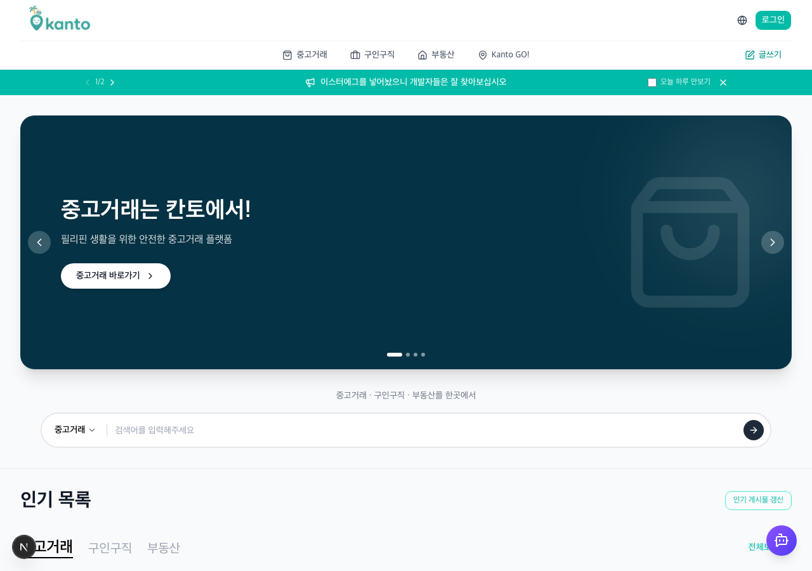
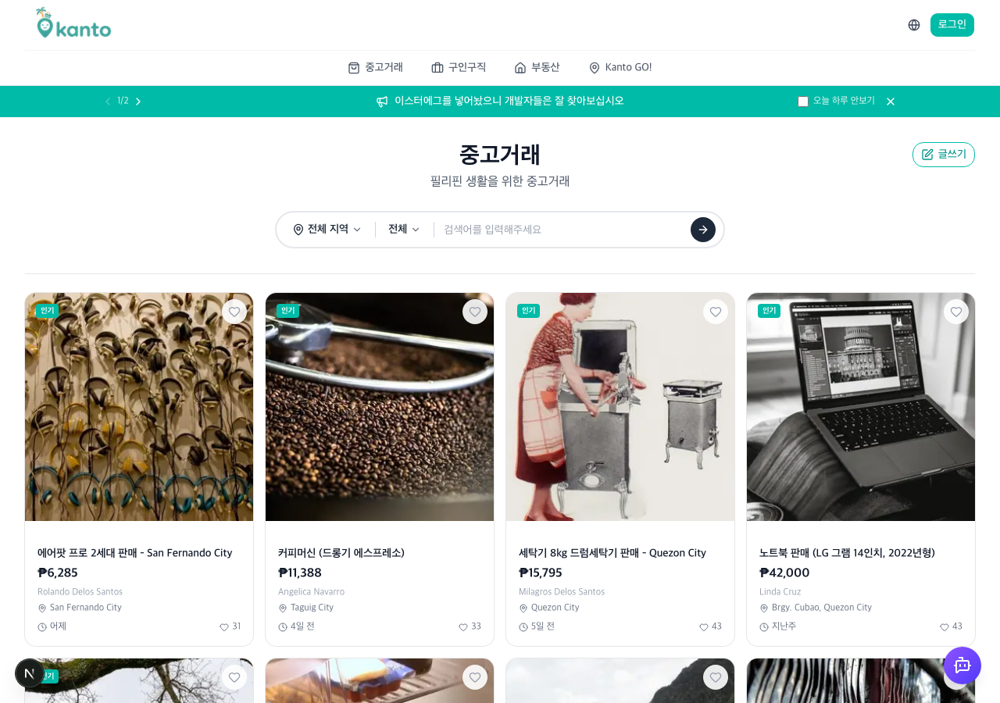

# Kanto 15차 리뷰 (2026-06-30 10:56)

범위: develop, 14차(6/29) 이후 변경분. 소프트딜리트 도입과 어드민 글관리, 채팅 미읽음 카운트, 거래지역 정리·삭제 흐름 정비가 이번 회차의 큰 줄기였습니다. 라이브 dev 부팅으로 SEO 인프라를 다시 확인했고, 서버 함수·서버액션·API 라우트를 중심으로 코드를 봤습니다.

---

## 1. 지난(14차) 반영 현황

14차에서 `[필수]`로 짚었던 항목들은 대부분 정리됐습니다. 하나씩 대조해 보면 이렇습니다.

| 지난 지적 | 상태 | 확인한 곳 |
| --- | --- | --- |
| `[필수]` main/page.tsx가 서버 컴포넌트인데 클라 훅 `useTranslations`를 top-level 호출 | **해결** | `src/app/(user)/main/page.tsx:2` 에서 `getTranslations`(next-intl/server)로 전환, `await`로 받습니다 |
| `[필수]` job/[id]·rental/[id] JSON-LD 삽입으로 생긴 orphaned div | **해결** | 두 상세 페이지 모두 래퍼가 정상적으로 닫혀 있습니다 |
| `[제안]` robots.ts 로그인 전용 경로 누락(/profile·/favorites·/notifications·/myposts·/create·/payment·/go) | **해결** | disallow 목록에 반영됐고, 비공개 페이지 metadata에 `robots:{ index:false }`도 들어갔습니다 |

main 페이지의 서버/클라 경계를 깔끔히 맞춘 점, robots와 noindex를 보험까지 챙긴 점은 칭찬하고 싶습니다. SEO 쪽은 14차에 이어 이번에도 빈틈이 잘 메워졌습니다.

---

## 2. E2E 결과 (2026-06-30, dev 부팅)

dev 서버로 띄워 공개 페이지를 확인했습니다.

- `/main` — `<html lang="ko-KR">`, `<title>홈 | 칸토</title>` 로 정상 렌더. 크롤러가 받을 완성 HTML이 잘 나옵니다.
- `/sitemap.xml` → 200, `/robots.txt` → 200. SEO 인프라가 완비돼 있습니다. 다섯 조 중 이 수준까지 갖춘 곳은 칸토뿐이라, 이 부분은 강하게 칭찬합니다.

캡처:




> 참고로 로컬에서 한 가지 걸린 게 있습니다. `NEXT_PUBLIC_BASE_URL`이 비어 있으면 `layout.tsx:25`의 `new URL(BASE_URL)`이 예외를 던져서 루트가 500으로 떨어집니다(사이트 전체가 못 뜸). 배포 환경엔 값이 들어가 있을 테니 실서비스 문제는 아니지만, `metadataBase`에 fallback 가드를 하나 두면 누가 env 없이 받아도 화면은 뜨니 안전합니다. 아래 `[제안]`에 정리했습니다.

---

## 3. 이번에 새로 본 것 — `[필수]`

### 3-1. `[필수]` getUsedGoodsItem에 소프트딜리트 필터 누락 — 삭제된 중고 상세가 그대로 노출

`src/services/usedGoods/usedGoods.ts:92` 의 `getUsedGoodsItem`을 보면, 다른 상세 조회와 달리 status 가드가 전혀 없습니다.

```ts
export async function getUsedGoodsItem(postId: number) {
  const supabase = await createClient();
  const { data } = await supabase
    .from("used_goods")
    .select(`*, posts (*, users!posts_user_id_fkey (...))`)
    .eq("post_id", postId)
    .single();          // status 체크 없음
  return data;
}
```

구인은 `getJobDetail`, 렌탈은 `getRentalDetail(src/services/rental/rental.ts:28)`에서 status가 `"deleted"`면 막아 줍니다(렌탈은 가져온 뒤 `status === "deleted"` 검사로 NOT_FOUND를 던집니다). 중고만 이 가드가 빠졌습니다. 같은 파일 위쪽의 `getUsedGoodsDetail(usedGoods.ts:84)`에는 `.neq("status", "deleted")`가 있는데, 정작 상세 페이지가 쓰는 `getUsedGoodsItem`에는 없다 보니 소프트딜리트한 중고 글의 `/usedgoods/[id]`가 검색·직링크로 계속 열립니다. 소프트딜리트를 도입한 의도(목록에서 감추고 30일 뒤 영구삭제)가 상세에서 새는 셈입니다.

처방은 둘 중 하나입니다. 쿼리에 `.eq("posts.status", "deleted")`를 뒤집은 필터를 거는 방법은 중첩 테이블 필터라 조금 까다롭습니다. 더 간단한 건 가져온 뒤 page에서 `data.posts.status === "deleted"`면 `notFound()`로 보내는 쪽인데, 렌탈이 쓰는 이 방식이 일관성도 좋고 읽기도 쉽습니다. 가이드에 코드로 정리해 뒀습니다.

### 3-2. `[필수][보안]` bulkPostActions 서버액션에 requireAdmin 게이트 없음

`src/app/(admin)/admin/posts/_actions/bulkPostActions.ts`의 `bulkTogglePostStatus`·`bulkRestorePosts`·`bulkDeletePosts` 세 함수 모두 `"use server"`인데 인가 검사가 없습니다. `getCurrentAdminId()`로 현재 관리자 id를 조회하긴 하지만, 그 값이 null이어도 그냥 진행하고, 애초에 "관리자인지"를 막는 게이트가 없습니다.

같은 폴더의 `deletePost.ts:9`는 첫 줄에서 `await requireAdmin()`을 부릅니다. 팀에 이미 `requireAdmin`(src/services/user/user.ts:51, role이 admin/super_admin이 아니면 throw)이라는 헬퍼가 있고 다른 어드민 액션은 이걸 쓰는데, bulk 쪽만 빠졌습니다.

서버액션은 URL 엔드포인트처럼 클라이언트에서 직접 호출될 수 있어서, 화면에 어드민 버튼이 안 보인다고 안전한 게 아닙니다. 일반 회원이 임의의 postId 배열로 `bulkDeletePosts([...])`를 호출하면 남의 글을 소프트딜리트할 수 있습니다. 세 함수 첫 줄에 각각 `await requireAdmin();`을 넣어 막아 주세요. 이게 이번 회차에서 가장 먼저 손봐야 할 항목입니다.

### 3-3. `[필수]` cleanup 크론 라우트가 fail-open

`src/app/api/posts/cleanup/route.ts:9` 가 이렇게 돼 있습니다.

```ts
const secret = process.env.CRON_SECRET;
if (secret) {
  const auth = request.headers.get("authorization");
  if (auth !== `Bearer ${secret}`) {
    return NextResponse.json({ error: "Unauthorized" }, { status: 401 });
  }
}
// secret이 없으면 검증을 통째로 건너뛰고 그대로 영구삭제 실행
```

`CRON_SECRET`이 설정돼 있을 때만 인증하고, 설정이 누락되면 아무 검증 없이 통과합니다(fail-open). 이 라우트는 소프트딜리트된 글을 `delete()`로 영구삭제하는 곳이라, env 한 줄을 빠뜨리면 누구나 POST로 영구삭제를 트리거할 수 있게 됩니다. 보안은 "값이 없으면 막는다"(fail-closed)가 원칙입니다. `if (!secret) return 500`을 앞에 둬서, secret이 없으면 동작 자체를 거부하도록 뒤집어 주세요.

### 3-4. `[필수]` 렌탈 채팅 가격이 항상 null — post_type 오타

`src/app/api/chat/[id]/route.ts:61` 의 분기에 오타가 있습니다.

```ts
const postPrice =
  posts?.post_type === "used_goods"
    ? (posts.used_goods[0]?.price ?? null)
    : posts?.post_type === "rentals"   // ← "rentals"가 아니라 "rental"
      ? (posts.rentals[0]?.price ?? null)
      : null;
```

DB에 저장되는 렌탈의 `post_type` 값은 `"rental"`(단수)입니다. sitemap.ts:18, services/rental/rental.ts:53·146, RentalCreateForm.tsx:300, api/posts/[id]/route.ts:48 전부 `"rental"`을 씁니다. 여기서만 `"rentals"`(복수)와 비교하다 보니 이 분기가 절대 참이 못 돼서, 렌탈 채팅 가격이 항상 null로 내려갑니다. select에서 관계 테이블을 `rentals`(복수)로 부르는 건 테이블명이라 맞는데, 이게 헷갈려서 더 새기 쉬운 오타입니다. `"rental"`로 고치면 됩니다.

---

## 4. 조원별

### 박소유 (soyu)

공지 버그·번개모임 드롭다운·탭 타이틀·챗봇 마크다운 정리, WebVitals 성능 감사, 시드 타입 수정까지 폭이 넓었습니다.

- `[사소]` WebVitalsReporter에 dev 가드를 둔 처리는 좋습니다. 개발 중 콘솔이 지저분해지지 않게 하는 배려가 보입니다.
- `[제안]` UnifiedBanner에서 배너를 띄울 목록 경로를 배열로 하드코딩해 두셨는데, 경로가 늘면 매번 배열을 손대야 합니다. `LIST_PATHS` 같은 상수로 빼고 `startsWith`로 매칭하면 `/usedgoods/123` 같은 하위 경로까지 한 번에 걸립니다.

### 김도혁 (DoHyuk-Centric)

소프트딜리트 도입, 어드민 글 관리, 시드/Storage 업로드, 외부 이미지 도메인 허용, 조회수 RPC까지 이번 회차 핵심 인프라를 많이 맡으셨습니다. 소프트딜리트로 방향을 잡은 건 좋은 선택이라 생각합니다 — 실수로 지운 글을 복구할 여지가 생기고, 30일 유예도 합리적입니다.

다만 도입한 정책이 코드 전반에 고르게 적용됐는지가 관건인데, 위 `[필수]`들이 주로 이 영역입니다. `getUsedGoodsItem`에 status 가드가 빠진 점(3-1), `bulkPostActions`에 `requireAdmin`이 빠진 점(3-2), cleanup이 fail-open인 점(3-3) 세 가지를 우선 봐 주세요. 좋은 정책일수록 "어디 한 곳이라도 새면 정책 전체가 무너진다"는 점을 같이 새기면 좋겠습니다.

### 이동근 (dongkeun)

목록/찜/내글 UI 통일, 본인 글 삭제 버그, 구인구직 지도 핀, 안전결제 흐름, 채팅 미읽음 카운트까지 사용자 흐름 전반을 손보셨습니다.

- `[필수]` 위 3-4(렌탈 채팅 가격 null) 오타가 이 영역입니다. 한 글자라 금방 고쳐집니다.
- `[제안]` CompanyLocationMap에서 `NEXT_PUBLIC_GOOGLE_MAPS_API_KEY`를 non-null assertion(`!`)으로만 받고 있어, 키가 없으면 조용히 실패합니다. 키가 없을 때 "지도를 불러올 수 없습니다" 같은 안내 블록으로 떨어지게 가드를 두면, 배포 환경에서 키 누락을 바로 알아챌 수 있습니다.
- `[사소]` 미읽음 카운트 마이그레이션에 기존 행의 `null → 0` UPDATE가 포함됐는지 한 번 확인해 주세요. 새 컬럼만 추가하고 기존 행을 안 채우면, 기존 채팅들의 카운트가 null로 남아 표시가 어긋날 수 있습니다.

### 임태형 (THLIMM)

거래지역 중복 필드 제거, DeleteButton 병합 충돌 정리, 삭제 후 목록 노출 수정(api 신설), 구인 필수항목 검증까지 정리 작업을 많이 하셨습니다.

- `[필수][설계]` 삭제 정책이 두 갈래로 갈려 있습니다. 사용자 본인 삭제(`api/posts/[id]/route.ts:56`)는 자식 테이블까지 `delete()`로 **하드 삭제**하는데, 어드민 삭제(`deletePost`·`bulkDeletePosts`)는 `status: "deleted"`로 **소프트 삭제**합니다. 둘이 섞여 있으면 "사용자가 지운 글은 복구 불가, 어드민이 지운 글만 30일 유예"가 되는데, 이게 의도하신 정책인가요? 혹시 사용자 삭제도 소프트로 통일하려다 작업이 갈렸다면, 팀에서 한 번 합의해서 한쪽으로 맞추는 게 좋겠습니다. (cleanup 크론이 소프트 삭제분만 청소하니, 정책을 소프트로 통일하면 흐름이 한 줄로 깔끔해집니다.)
- `[제안]` 구인 필수항목 검증이 클라이언트(`useCreateJobForm.ts`)에만 있습니다. 클라 검증은 UX용이고, 실제 방어선은 서버액션이라 생각합니다. 빈 값으로 직접 호출하면 그대로 들어가니, 서버액션에도 같은 필수값 체크를 한 번 더 둬 주세요.
- `[사소]` 이번 회차에 병합 충돌 정리 커밋이 두어 건 보입니다. 머지 전에 `npx tsc --noEmit`·`npm run build`를 한 번 통과시키고 올리면, 충돌이 남긴 타입 깨짐을 미리 거를 수 있습니다.

---

## 5. 팀 공통

- **어드민 서버액션 인가 일관성.** `deletePost`는 `requireAdmin`을 쓰는데 `bulkPostActions`는 빠졌습니다. "use server"가 붙은 함수는 전부 엔드포인트라고 보고, 첫 줄에 `requireAdmin`을 두는 걸 팀 규칙으로 정해 두면 이런 누락이 줄어듭니다. 어드민 액션 파일을 한 번 훑어 빠진 곳이 더 없는지 같이 확인해 주세요.
- **소프트딜리트 scope 명확화.** status가 `"deleted"`인 글이 어디서도 새지 않도록 상세·목록·검색·연관 조회를 함수 단위로 체크리스트화해 두면 좋겠습니다. 이번 `getUsedGoodsItem` 누락이 딱 그 사례입니다.
- **post_type 리터럴 상수화.** `"rental"`/`"jobs"`/`"used_goods"`를 문자열로 곳곳에 직접 쓰다 보니 3-4 같은 오타가 났습니다. `const POST_TYPE = { RENTAL: "rental", ... } as const` 로 묶어 쓰면, 오타가 컴파일 타임에 잡힙니다.

---

## 6. Top 3 (우선순위)

1. `[필수]` getUsedGoodsItem 소프트딜리트 필터 누락 — 삭제된 중고 상세 노출 (3-1)
2. `[필수][보안]` bulkPostActions에 requireAdmin 게이트 없음 — 일반 회원이 남의 글 조작 가능 (3-2)
3. `[필수]` cleanup 크론 fail-open — env 누락 시 무인증 영구삭제 (3-3)

여기에 렌탈 채팅 가격 null 오타(3-4)는 한 글자라 같이 빠르게 고쳐 주세요. 해결 방법은 함께 보내는 가이드에 단계별로 정리해 뒀습니다. 천천히 그렇지만 꾸준히 갑시다. 화이팅입니다.
